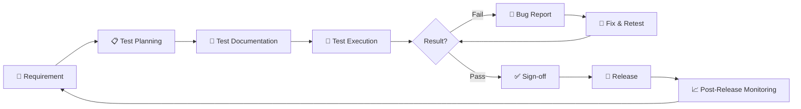

# 🎮 Idle / Tycoon Game — QA Test Checklists

A collection of manual testing checklists and QA workflow documentation for mobile casual games in the **idle** and **tycoon** genres.

[](https://github.com/aqilaptri12)
[](https://github.com/aqilaptri12)
[](https://github.com/aqilaptri12)
[](https://github.com/aqilaptri12)

---

## 📖 Overview

This repository contains structured QA documentation for mobile idle/tycoon games. It covers **feature-level checklists**, **mobile-specific scenarios**, and **end-to-end QA workflows** — reflecting a practical understanding of manual testing in a GameDev context.

**Coverage:**
- ✅ Core gameplay features (resource generation, upgrades, prestige, offline progress)
- ✅ Monetization systems (IAP, ads)
- ✅ Persistence (save/load)
- ✅ Mobile-specific edge cases (interruptions, network, background/foreground)
- ✅ End-to-end QA workflow (requirement → release)
- ✅ Bug lifecycle (discovery → closure)

---

## 📂 Repository Structure

```
idle-tycoon-test-checklists/
├── README.md
├── checklists/                  # Feature-level test checklists
│   ├── resource-generation.md
│   ├── upgrade-system.md
│   ├── prestige-system.md
│   ├── offline-progress.md
│   ├── monetization.md
│   ├── ads.md
│   └── save-load.md
├── mobile-specific/             # Mobile edge cases
│   ├── interruptions.md
│   ├── network-issues.md
│   └── background-foreground.md
└── docs/                        # QA process documentation
    ├── testing-flow.md          # End-to-end QA workflow (Mermaid)
    └── bug-lifecycle.md         # Bug lifecycle (Mermaid)
```

---

## 📋 Checklist Index

### 🎮 Core Gameplay

| Feature | File | Priority |
|---|---|---|
| Resource Generation | [checklists/resource-generation.md](checklists/resource-generation.md) | P1 |
| Upgrade System | [checklists/upgrade-system.md](checklists/upgrade-system.md) | P1 |
| Prestige System | [checklists/prestige-system.md](checklists/prestige-system.md) | P1 |
| Offline Progress | [checklists/offline-progress.md](checklists/offline-progress.md) | P1 |

### 💰 Monetization & Persistence

| Feature | File | Priority |
|---|---|---|
| Monetization / IAP | [checklists/monetization.md](checklists/monetization.md) | P0 |
| Ads (Reward & Interstitial) | [checklists/ads.md](checklists/ads.md) | P1 |
| Save / Load | [checklists/save-load.md](checklists/save-load.md) | P0 |

### 📱 Mobile-Specific Scenarios

| Scenario | File | Priority |
|---|---|---|
| Interruptions (call, SMS, alarm) | [mobile-specific/interruptions.md](mobile-specific/interruptions.md) | P1 |
| Network Issues (offline, slow, drop) | [mobile-specific/network-issues.md](mobile-specific/network-issues.md) | P1 |
| Background / Foreground | [mobile-specific/background-foreground.md](mobile-specific/background-foreground.md) | P1 |

---

## 📊 QA Workflow Documentation

End-to-end QA process, from requirement to post-release monitoring.

| Document | Description |
|---|---|
| [docs/testing-flow.md](docs/testing-flow.md) | Complete QA workflow with Mermaid flowchart (upstream → midstream → downstream) |
| [docs/bug-lifecycle.md](docs/bug-lifecycle.md) | Bug lifecycle from discovery to closure, including severity/priority matrix |

### Quick Preview: Testing Flow



---

## 🎯 How to Use

1. **Pick a checklist** from the index above based on the feature you're testing.
2. **Follow the flow** in [docs/testing-flow.md](docs/testing-flow.md) to understand where the checklist fits in the QA lifecycle.
3. **Tick each item** using `[x]` as you verify.
4. **Log failures** using the bug report template in [docs/bug-lifecycle.md](docs/bug-lifecycle.md).
5. **Update the checklist** as new edge cases are discovered.

---

## 🧠 Why This Repo Exists

This repository demonstrates:

- **Domain knowledge** of idle/tycoon mobile game mechanics
- **Test documentation skills** — structured, prioritized, and maintainable
- **Holistic QA thinking** — from requirement review to post-release monitoring
- **Mobile-first mindset** — covering real-world mobile edge cases
- **Process orientation** — visualizing QA workflow and bug lifecycle

It is part of my QA portfolio targeting **Junior QA (Manual) roles in GameDev**, with a focus on continuous learning and AI-assisted testing.

---

## 🔗 Related Repositories

| Repo | Description |
|---|---|
| [`aqilaptri12.github.io`](https://github.com/aqilaptri12/aqilaptri12.github.io) | Main QA portfolio & CV website |
| [`casual-game-test-cases`](https://github.com/aqilaptri12/casual-game-test-cases) | Detailed test cases for casual games |
| [`bug-report-samples`](https://github.com/aqilaptri12/bug-report-samples) | Sample bug reports |
| [`ai-qa-prompt-library`](https://github.com/aqilaptri12/ai-qa-prompt-library) | AI prompts for QA workflows |

---

## 📌 Notes

- All checklists are **manual testing** oriented.
- Priority levels: **P0** (Critical) · **P1** (High) · **P2** (Medium) · **P3** (Low).
- Checklists are living documents — updated as new features and edge cases emerge.
- Mermaid diagrams render automatically on GitHub.

---

## 📄 License

MIT — free to use, adapt, and share.

---

## 👤 Author

**Aqila Putri** — Junior QA (Manual) | GameDev & AI Enthusiast

- 🌐 Portfolio: [aqilaptri12.github.io](https://aqilaptri12.github.io/)
- 💻 GitHub: [@aqilaptri12](https://github.com/aqilaptri12)
- 💼 LinkedIn: [aqila-putri](https://www.linkedin.com/in/aqila-putri-a263b5278)

---

⭐ If you find this useful, consider starring the repo!
