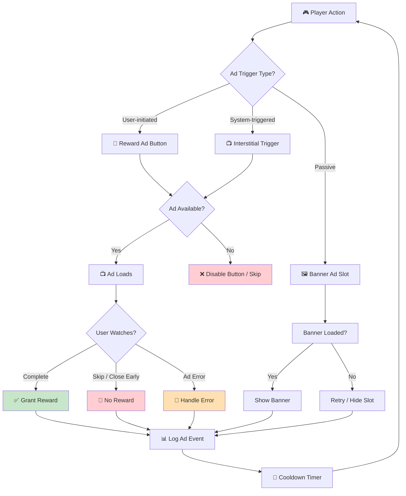

# Checklist: Ads (Reward & Interstitial)

**Feature:** Advertisement systems — reward video, interstitial, and banner ads.  
**Type:** Functional, Regression, Integration, Performance  
**Priority:** P1 (High)  
**Platform:** iOS, Android  
**Last Updated:** 2025-01-XX

---

## 📖 Overview

Mobile idle/tycoon games rely heavily on ad monetization. This checklist covers **reward videos**, **interstitial ads**, **banner ads**, and their interaction with the game loop, network, and IAP.

**Ad Types Covered:**
- **Reward Video** — user-initiated, grants in-game reward
- **Interstitial** — full-screen ad shown at natural breaks
- **Banner** — persistent small ad (if applicable)
- **Offerwall** — optional, if the game uses it

---

## 🔄 Ad Lifecycle Flow

---

## ✅ Core Checks — Reward Video

- [ ] Reward ad button appears in the correct location (e.g., "Watch Ad for 2x Gold")
- [ ] Button is only enabled when an ad is available
- [ ] Tapping the button loads and plays the ad
- [ ] Ad plays in full screen
- [ ] Skip button (if any) is disabled until minimum watch time
- [ ] Close (X) button appears only after ad completes
- [ ] Reward is granted **immediately** after ad completion
- [ ] Reward popup appears with correct amount
- [ ] Cooldown timer starts after reward is granted
- [ ] Button is disabled during cooldown with visible countdown

## ✅ Core Checks — Interstitial

- [ ] Interstitial appears at appropriate moments (level complete, after prestige, on return)
- [ ] Interstitial does **NOT** appear during active gameplay
- [ ] Interstitial does **NOT** appear during tutorial (first session)
- [ ] Interstitial does **NOT** appear during IAP flow
- [ ] Interstitial has a visible close button
- [ ] Interstitial frequency cap is respected (e.g., max 1 per 3 minutes)
- [ ] First interstitial is delayed (e.g., after 5 minutes of play)
- [ ] Interstitial respects "no ads" IAP purchase (if applicable)

## ✅ Core Checks — Banner (if applicable)

- [ ] Banner loads at the correct position (top / bottom)
- [ ] Banner does not overlap important UI elements
- [ ] Banner does not block gameplay
- [ ] Banner refreshes at correct interval
- [ ] Banner respects "no ads" IAP purchase (if applicable)

---

## 🐛 Edge Cases

### Load Failures
- [ ] Ad fails to load → button shows "No ads available" or is disabled
- [ ] Ad fails to load → fallback reward option offered (if applicable)
- [ ] Ad fails to load 3x in a row → no infinite retry loop
- [ ] Ad SDK throws error → game does not crash
- [ ] Ad network timeout → handled gracefully

### User Behavior
- [ ] Closing ad early → **no reward granted** (correct behavior)
- [ ] Watching 5+ reward ads in a row → no crash, no memory leak
- [ ] Tapping ad button rapidly → only one ad plays
- [ ] Backgrounding app during ad → ad resumes or restarts properly
- [ ] Force-closing app during ad → no reward granted, no dupe

### Reward Integrity
- [ ] Reward is granted **exactly once** (no dupe)
- [ ] Reward amount matches the displayed value
- [ ] Reward is correctly added to player inventory
- [ ] Reward cannot be claimed by re-opening the ad
- [ ] Reward persists after app restart

### Interaction with Other Systems
- [ ] Ad during IAP flow → IAP is not interrupted
- [ ] Ad during tutorial → does not appear
- [ ] Ad during event popup → respects priority
- [ ] Ad during offline progress popup → does not appear
- [ ] Ad on low battery → does not drain excessively

---

## 📱 Mobile-Specific Checks

- [ ] Ad pauses when incoming call arrives
- [ ] Ad resumes correctly after call ends
- [ ] Ad adapts to screen rotation (if supported)
- [ ] Ad respects device volume settings
- [ ] Ad respects mute / silent mode
- [ ] Ad works on Wi-Fi and cellular
- [ ] Ad skips gracefully when network is offline
- [ ] Ad displays correctly on different screen sizes (phone, tablet)
- [ ] Ad works on Android 10+ and iOS 14+
- [ ] Ad respects "Limit Ad Tracking" / "Allow Apps to Request to Track" (iOS 14.5+)

---

## 🌐 Network Scenarios

- [ ] Ad loads on 4G / 5G
- [ ] Ad loads on slow 3G connection
- [ ] Ad fails gracefully when offline
- [ ] Ad retries when connection is restored
- [ ] Ad does not hang indefinitely when network drops mid-load
- [ ] Ad does not corrupt game state when network drops mid-reward

---

## 🎯 Regression Checks (After Ad SDK Update)

- [ ] All reward ad placements still work
- [ ] Interstitial frequency cap still respected
- [ ] Reward amounts unchanged
- [ ] Cooldown timers still correct
- [ ] No new crashes in ad-related flows
- [ ] Analytics events still firing correctly
- [ ] No ads shown to users who purchased "Remove Ads"

---

## 📊 Analytics & Logging

- [ ] Ad impression is logged
- [ ] Ad click is logged
- [ ] Ad completion is logged
- [ ] Ad failure reason is logged
- [ ] Reward grant event is logged
- [ ] Cooldown start event is logged
- [ ] Ad revenue event is sent to backend

---

## ⚡ Performance Checks

- [ ] Ad load time < 3 seconds on average
- [ ] Ad does not cause frame drops during gameplay
- [ ] Ad does not increase app memory significantly
- [ ] Ad does not drain battery abnormally
- [ ] Ad close returns user to correct game state quickly (< 1s)

---

## 🧪 Test Scenarios (Sample)

### Scenario 1: Happy Path — Reward Ad
1. Open game → wait for ad SDK to initialize
2. Tap "Watch Ad for 2x Gold" button
3. Ad plays for full duration
4. Close ad → reward popup appears
5. **Expected:** 2x Gold granted, cooldown timer starts

### Scenario 2: Early Close — Reward Ad
1. Tap reward ad button
2. After 5 seconds, tap close button
3. **Expected:** No reward granted, cooldown NOT started, button re-enabled

### Scenario 3: No Ad Available
1. Simulate ad SDK returning "no fill"
2. Tap reward ad button
3. **Expected:** Button shows "No ads available", no crash, optional fallback offered

### Scenario 4: Network Drop During Ad
1. Start reward ad
2. Mid-ad, turn off Wi-Fi
3. **Expected:** Ad either completes (cached) or fails gracefully with retry option

### Scenario 5: Interstitial Frequency Cap
1. Complete 5 levels in a row quickly
2. **Expected:** Interstitial appears at most once per 3 minutes

---

## 📋 Priority Matrix

| Check | Priority | Severity if Failed |
|---|---|---|
| Reward granted once | P0 | Critical |
| No crash on ad fail | P0 | Critical |
| Interstitial not during IAP | P0 | Critical |
| Cooldown works | P1 | Major |
| Analytics event | P1 | Major |
| Banner position | P2 | Minor |
| Ad load time | P2 | Minor |

---

## 🔗 Related Checklists

- [Monetization / IAP](monetization.md)
- [Network Issues](../mobile-specific/network-issues.md)
- [Background / Foreground](../mobile-specific/background-foreground.md)
- [Testing Flow](../docs/testing-flow.md)
- [Bug Lifecycle](../docs/bug-lifecycle.md)

---

## 📝 Notes

- **Ad SDK version:** Record which SDK version was tested
- **Ad networks:** Record which networks were tested (AdMob, Unity Ads, IronSource, etc.)
- **Test devices:** Record device models and OS versions
- **Known issues:** Link to open bug tickets if any
- This checklist is a **living document** — update after each ad SDK update or monetization change
