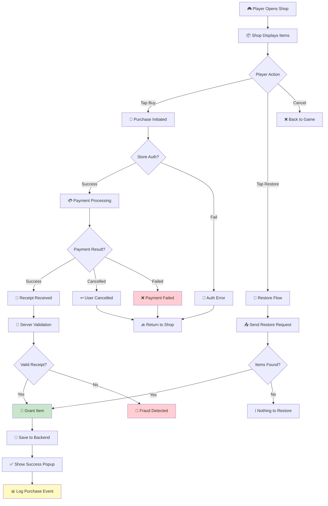

# Checklist: Monetization / IAP

**Feature:** In-App Purchases, shop, and virtual currency systems.  
**Type:** Functional, Regression, Integration, Security, Payment  
**Priority:** P0 (Critical)  
**Platform:** iOS, Android  
**Last Updated:** 2025-01-XX

---

## 📖 Overview

Monetization is the **lifeblood** of idle/tycoon games. A single bug in IAP can cause **revenue loss, refund requests, angry users, and store policy violations**. This checklist covers the full purchase lifecycle, from shop display to receipt validation and refund handling.

**Monetization Types Covered:**
- **Consumable IAP** — gems, gold, boosters
- **Non-consumable IAP** — remove ads, VIP unlock
- **Subscription** — if applicable (monthly pass, battle pass)
- **Virtual currency** — coins, gems, tokens
- **Offerwall / rewarded actions** — optional

---

## 🔄 Purchase Lifecycle Flow

---

## ✅ Core Checks — Shop Display

- [ ] Shop opens without lag or crash
- [ ] All items are displayed with correct names
- [ ] All items are displayed with correct prices
- [ ] Prices match the local currency (IDR, USD, EUR, etc.)
- [ ] Prices include tax where applicable (or clearly exclude)
- [ ] Item descriptions are accurate
- [ ] Item icons match the actual item
- [ ] "Best Value" / "Popular" badges appear correctly
- [ ] Bundle contents are clearly listed
- [ ] Shop scrolls smoothly with many items
- [ ] Sold-out or limited-time items show correct state
- [ ] Currency symbol is correct for the region

## ✅ Core Checks — Purchase Flow

- [ ] Tapping "Buy" initiates the store purchase dialog
- [ ] Store dialog shows correct item and price
- [ ] Entering valid payment → purchase completes
- [ ] After purchase, item is delivered **immediately**
- [ ] Success popup appears with item details
- [ ] Item is visible in player inventory
- [ ] Item count is correct (e.g., 100 gems, not 10)
- [ ] Purchase is saved to backend
- [ ] Purchase survives app restart
- [ ] Purchase survives device restart
- [ ] Receipt is stored for validation

## ✅ Core Checks — Restore Purchase (Non-Consumable)

- [ ] "Restore Purchases" button is visible in settings/shop
- [ ] Tapping restore → shows loading indicator
- [ ] Previously purchased non-consumables are restored
- [ ] "Remove Ads" restores and ads disappear
- [ ] VIP status restores correctly
- [ ] Restore does **NOT** re-grant consumables
- [ ] Restore works after reinstall
- [ ] Restore works on new device (same account)

## ✅ Core Checks — Consumable Integrity

- [ ] Consumable item is granted exactly **once**
- [ ] Consumable can be purchased repeatedly
- [ ] Consumable is not restored (correct behavior)
- [ ] Consumable quantity stacks correctly
- [ ] Consumable is consumed properly when used

---

## 🐛 Edge Cases

### Double Purchase / Dupe Protection
- [ ] Double-tapping "Buy" → only one purchase dialog
- [ ] Rapid tapping "Buy" → no duplicate charges
- [ ] Purchase dialog opens → app backgrounded → returns → no double charge
- [ ] Two devices, same account → no double grant

### Cancellation & Failure
- [ ] User cancels store dialog → no charge, no item, back to shop
- [ ] User cancels mid-payment → no partial charge
- [ ] Payment fails (insufficient funds) → clear error message
- [ ] Payment fails → user can retry without restart
- [ ] Payment fails → no item granted (correct)
- [ ] Payment fails → no resources lost from player

### Network Issues
- [ ] Buying while offline → clear error message
- [ ] Network drops mid-purchase → purchase completes or safely fails
- [ ] Network drops after payment but before grant → item granted on retry
- [ ] Slow network → loading indicator shown
- [ ] Slow network → user cannot spam buy button

### Server & Validation
- [ ] Receipt is validated on server before granting
- [ ] Invalid receipt → item NOT granted, logged as fraud
- [ ] Duplicate receipt → item NOT granted twice
- [ ] Server timeout → purchase queued for retry
- [ ] Server error → clear error message to user
- [ ] Server rollback → item removed if purchase reversed

### Refund & Chargeback
- [ ] Refunded purchase → item removed from account
- [ ] Refunded purchase → virtual currency deducted (if spent, balance goes negative or blocked)
- [ ] Chargeback → account flagged for review
- [ ] Refund does not crash the game

### Account & Device
- [ ] Purchase tied to correct account
- [ ] Logging out → item no longer accessible
- [ ] Logging in on new device → item accessible
- [ ] Guest account → purchase → link account → item preserved
- [ ] Multiple accounts on same device → purchases separated

---

## 📱 Mobile-Specific Checks

- [ ] Purchase flow works on iOS App Store
- [ ] Purchase flow works on Google Play Store
- [ ] Purchase flow works with sandbox/test accounts
- [ ] Purchase works with biometric auth (Face ID, fingerprint)
- [ ] Purchase works with password auth
- [ ] Purchase respects parental controls
- [ ] Purchase respects "Ask to Buy" (iOS)
- [ ] Purchase works on low battery mode
- [ ] Purchase flow handles incoming call interruption
- [ ] Purchase flow handles backgrounding correctly

---

## 🔐 Security & Anti-Fraud Checks

- [ ] Receipt validation is done **server-side**, not client-side
- [ ] Client cannot grant items without server approval
- [ ] Jailbroken/rooted device → purchase still validated
- [ ] Modified client → purchase rejected
- [ ] Replay attack → duplicate receipts rejected
- [ ] Fake receipt → rejected and logged
- [ ] Purchase logs include user ID, timestamp, item, price
- [ ] Suspicious activity triggers alert

---

## 🌐 Localization & Regional Checks

- [ ] Prices display in correct local currency
- [ ] Currency conversion is accurate
- [ ] Prices respect regional pricing tiers
- [ ] Tax is correctly calculated or excluded
- [ ] Item names translated correctly
- [ ] Descriptions translated correctly
- [ ] Purchase flow works in all supported regions
- [ ] Region-restricted items are hidden

---

## 🎯 Regression Checks (After Store SDK Update)

- [ ] All IAP items still purchasable
- [ ] Prices unchanged
- [ ] Item grants still work
- [ ] Restore flow still works
- [ ] Receipt validation still works
- [ ] Analytics events still fire
- [ ] No new crashes in purchase flow
- [ ] Sandbox testing still works

---

## 📊 Analytics & Logging

- [ ] Shop open event logged
- [ ] Item view event logged
- [ ] Purchase initiated event logged
- [ ] Purchase success event logged
- [ ] Purchase failed event logged (with reason)
- [ ] Purchase cancelled event logged
- [ ] Restore event logged
- [ ] Refund event logged
- [ ] Revenue amount sent to backend
- [ ] Purchase attribution to campaign/source

---

## ⚡ Performance Checks

- [ ] Shop loads in < 2 seconds
- [ ] Purchase flow completes in < 10 seconds
- [ ] Item grant happens in < 3 seconds after payment
- [ ] No frame drops during shop scroll
- [ ] No memory leaks after multiple purchases

---

## 🧪 Test Scenarios (Sample)

### Scenario 1: Happy Path — Buy 100 Gems
1. Open shop
2. Tap "100 Gems" bundle
3. Confirm purchase in store dialog
4. Complete payment
5. **Expected:** 100 gems granted, popup shown, balance updated, purchase logged

### Scenario 2: Cancel Purchase
1. Open shop → tap "Buy"
2. Cancel in store dialog
3. **Expected:** No charge, no item, back to shop, error message dismissed

### Scenario 3: Network Drop Mid-Purchase
1. Start purchase
2. Turn off Wi-Fi during payment
3. **Expected:** Purchase either completes from cache or fails safely with retry option

### Scenario 4: Restore After Reinstall
1. Purchase "Remove Ads" on Device A
2. Uninstall app
3. Reinstall and log in
4. Tap "Restore Purchases"
5. **Expected:** Ads disappear, no double charge

### Scenario 5: Fraud Attempt
1. Use modified client to send fake receipt
2. **Expected:** Server rejects, item not granted, user flagged

### Scenario 6: Refund Flow
1. Purchase 500 gems
2. Request refund via store
3. Store processes refund
4. **Expected:** Gems deducted, if spent balance handled per policy

---

## 📋 Priority Matrix

| Check | Priority | Severity if Failed |
|---|---|---|
| Purchase grants item correctly | P0 | Critical |
| No double charge | P0 | Critical |
| Receipt validation server-side | P0 | Critical |
| Restore non-consumable works | P0 | Critical |
| Cancel → no charge | P1 | Major |
| Refund handling | P1 | Major |
| Local currency correct | P1 | Major |
| Shop UI smooth | P2 | Minor |
| Analytics event | P2 | Minor |

---

## 🔗 Related Checklists

- [Ads](ads.md)
- [Network Issues](../mobile-specific/network-issues.md)
- [Background / Foreground](../mobile-specific/background-foreground.md)
- [Interruptions](../mobile-specific/interruptions.md)
- [Testing Flow](../docs/testing-flow.md)
- [Bug Lifecycle](../docs/bug-lifecycle.md)

---

## 📝 Notes

- **Store SDK version:** Record App Store / Play Billing version tested
- **Sandbox accounts:** List sandbox accounts used for testing
- **Test devices:** Record device models and OS versions
- **Payment methods:** List payment methods tested (card, carrier billing, PayPal, etc.)
- **Regional testing:** List regions/currencies tested
- **Known issues:** Link to open bug tickets
- This checklist is a **living document** — update after each store policy change or monetization update

---

## ⚠️ Critical Reminders

- 🚨 **Never** grant items client-side without server validation
- 🚨 **Always** test refund flow before release
- 🚨 **Always** test restore flow on a clean device
- 🚨 **Always** test with real sandbox accounts, not mocks
- 🚨 **Always** log every purchase event with user ID and timestamp
