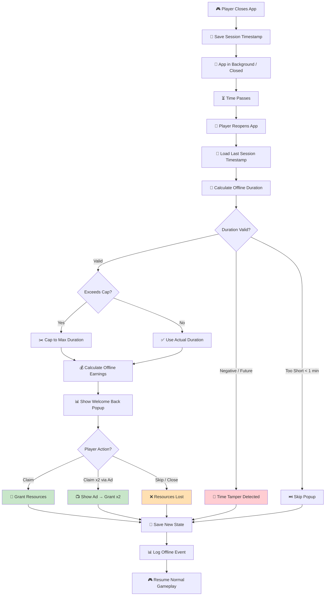

# Checklist: Offline Progress

**Feature:** Resource calculation and idle rewards while the game is closed or in background.  
**Type:** Functional, Regression, Time-based, Integration  
**Priority:** P1 (High)  
**Platform:** iOS, Android  
**Last Updated:** 2025-01-XX

---

## 📖 Overview

Offline progress is a **core retention mechanic** in idle/tycoon games. Players expect resources to accumulate while they're away. A bug here can cause **economy imbalance, exploit abuse, or player frustration**. This checklist covers the full offline lifecycle: session end → time passage → session resume → reward claim.

**Key Concepts:**
- **Offline window** — time between app close and reopen
- **Offline cap** — maximum time counted (e.g., 8h, 24h)
- **Offline rate** — resources per second while offline (often different from online rate)
- **Welcome back popup** — UI that shows offline earnings
- **Time tampering** — changing device clock to exploit the system

---

## 🔄 Offline Progress Lifecycle Flow

---

## ✅ Core Checks — Welcome Back Popup

- [ ] Popup appears after reopening the game (if offline > minimum threshold)
- [ ] Popup shows **time offline** correctly (e.g., "2h 15m")
- [ ] Popup shows **resources earned** correctly
- [ ] Popup shows **resource type** with icon
- [ ] Popup has a visible "Claim" button
- [ ] Popup has "Claim x2 (Watch Ad)" button (if applicable)
- [ ] Popup has a close/skip option
- [ ] Popup does not appear on first-ever launch
- [ ] Popup does not appear if offline < minimum threshold (e.g., 1 min)
- [ ] Popup does not block critical UI
- [ ] Popup is dismissible without crashing

## ✅ Core Checks — Time Calculation

- [ ] Offline duration is calculated from last save timestamp
- [ ] Duration is displayed in readable format (minutes, hours, days)
- [ ] Duration is capped at maximum offline cap
- [ ] Duration uses **server time** if available (anti-tamper)
- [ ] Duration accounts for timezone changes
- [ ] Duration accounts for daylight saving time changes
- [ ] Duration is consistent across app restarts

## ✅ Core Checks — Resource Calculation

- [ ] Resources earned = offline rate × offline duration
- [ ] Offline rate matches game design (may differ from online rate)
- [ ] Offline rate includes active upgrades and bonuses
- [ ] Offline rate respects temporary buffs (if applicable)
- [ ] Offline rate respects permanent prestige bonuses
- [ ] Resources are calculated per type (gold, gems, wood, etc.)
- [ ] Calculation is rounded correctly (no fractional resources)
- [ ] Calculation matches displayed preview in shop/upgrade UI

## ✅ Core Checks — Reward Claim

- [ ] Tapping "Claim" grants resources immediately
- [ ] Resource balance updates correctly
- [ ] Popup closes after claim
- [ ] Claimed resources are saved to backend
- [ ] Claimed resources survive app restart
- [ ] Claimed resources cannot be claimed twice
- [ ] Claim event is logged in analytics
- [ ] "Claim x2 via Ad" grants **double** resources (correct)
- [ ] "Claim x2 via Ad" only works if ad completes
- [ ] Skipping popup → resources are **NOT** granted (correct)

## ✅ Core Checks — Offline Cap

- [ ] Cap is respected (e.g., 8 hours max)
- [ ] Cap is displayed in UI (e.g., "Max 8h")
- [ ] Cap is configurable per player (via IAP or upgrades)
- [ ] Cap can be extended via "Offline Cap +2h" upgrade
- [ ] Cap is correctly applied to calculation
- [ ] Time beyond cap is **not** counted
- [ ] UI shows how much time was "wasted" beyond cap (optional)

---

## 🐛 Edge Cases

### Time Manipulation & Anti-Tamper
- [ ] Changing device clock forward 1 hour → **no** extra resources
- [ ] Changing device clock forward 1 day → **no** extra resources
- [ ] Changing device clock backward → **no** negative resources
- [ ] Changing device timezone → calculation still correct
- [ ] Server time vs device time mismatch → server time wins
- [ ] Airplane mode + clock change → handled gracefully
- [ ] Time tamper detected → logged and optionally flagged

### Short & Long Offline
- [ ] Offline < 1 minute → no popup (correct)
- [ ] Offline exactly 1 minute → popup appears (boundary test)
- [ ] Offline 1 hour → popup shows correct duration & reward
- [ ] Offline 24 hours → cap applied correctly
- [ ] Offline 7 days → cap applied, no overflow
- [ ] Offline 30 days → cap applied, no crash
- [ ] Offline with system clock at year 2099 → handled safely

### App Lifecycle
- [ ] Force close app → reopen → popup appears
- [ ] App backgrounded → foregrounded (short) → no popup
- [ ] App backgrounded → foregrounded (long, > threshold) → popup appears
- [ ] App killed by OS → reopen → popup appears
- [ ] App updated (store) → reopen → popup appears
- [ ] App reinstalled → popup behavior correct (data restored from cloud?)

### Multi-Device & Cloud Save
- [ ] Play on Device A → close → open on Device B → popup appears
- [ ] Play on Device A → close → open on Device A → popup appears
- [ ] Play on Device A → close → open on Device B → open on Device A → no double claim
- [ ] Cloud save sync → offline time calculated from last save
- [ ] Offline time not double-counted across devices

### Boundary & Overflow
- [ ] Offline duration = exactly cap → handled correctly
- [ ] Offline duration = cap + 1 second → capped correctly
- [ ] Offline reward > 2 billion → no overflow (uses big number)
- [ ] Offline reward with decimal → rounded correctly
- [ ] Offline duration = 0 → no popup

### Interaction with Other Systems
- [ ] Offline during active event → event time respected
- [ ] Offline during limited-time offer → offer expired correctly
- [ ] Offline during ad cooldown → cooldown completed
- [ ] Offline during prestige → prestige completed
- [ ] Offline during tutorial → popup does NOT appear (correct)

---

## 📱 Mobile-Specific Checks

- [ ] Popup appears correctly on Android 10+
- [ ] Popup appears correctly on iOS 14+
- [ ] Popup respects device language / locale
- [ ] Popup displays correctly on different screen sizes
- [ ] Popup works in portrait and landscape (if supported)
- [ ] Popup respects "Do Not Disturb" mode
- [ ] Popup appears after receiving a call during offline period
- [ ] Popup appears after alarm during offline period
- [ ] Popup appears after battery died and recharged
- [ ] Popup does not appear if app was only backgrounded for < threshold

---

## 🌐 Network Scenarios

- [ ] Offline calculation works when reopening online
- [ ] Offline calculation works when reopening offline
- [ ] Reopening offline → resources queued for claim when online
- [ ] Slow network → popup appears with loading state
- [ ] Server unreachable → fallback to local calculation
- [ ] Server time unavailable → uses device time with anti-tamper
- [ ] Offline reward syncs to server after claim

---

## 🎯 Regression Checks (After Update)

- [ ] Offline cap unchanged
- [ ] Offline rate unchanged
- [ ] Popup UI unchanged
- [ ] Claim flow unchanged
- [ ] No new crashes in offline flow
- [ ] Analytics events still firing
- [ ] Anti-tamper still works
- [ ] Multi-device sync still works

---

## 📊 Analytics & Logging

- [ ] Offline session start timestamp logged
- [ ] Offline session end timestamp logged
- [ ] Offline duration logged
- [ ] Offline reward amount logged
- [ ] Claim action logged
- [ ] Skip action logged
- [ ] Time tamper event logged (if detected)
- [ ] Offline cap hit event logged (if applicable)
- [ ] Offline reward type logged

---

## ⚡ Performance Checks

- [ ] Popup appears within 2 seconds of app launch
- [ ] Calculation completes in < 500ms
- [ ] No frame drops when popup animates
- [ ] No memory leak after multiple offline sessions
- [ ] No ANR (Android Not Responding) during calculation

---

## 🧪 Test Scenarios (Sample)

### Scenario 1: Happy Path — 2 Hour Offline
1. Note current resource balance
2. Close app completely
3. Wait 2 hours (or simulate)
4. Reopen app
5. **Expected:** Popup shows "2h", reward = rate × 2h, claim works

### Scenario 2: Cap Applied — 24 Hour Offline
1. Cap is set to 8h
2. Close app, wait 24 hours
3. Reopen app
4. **Expected:** Popup shows "8h" (capped), reward = rate × 8h

### Scenario 3: Time Tamper — Clock Forward
1. Close app
2. Change device clock forward 1 day
3. Reopen app
4. **Expected:** No extra reward, tamper event logged (or reward capped)

### Scenario 4: Short Offline — 30 Seconds
1. Close app
2. Wait 30 seconds
3. Reopen app
4. **Expected:** No popup (below threshold)

### Scenario 5: Claim x2 via Ad
1. Trigger offline popup
2. Tap "Claim x2 (Watch Ad)"
3. Complete ad
4. **Expected:** Double reward granted

### Scenario 6: Claim x2 — Ad Skipped
1. Trigger offline popup
2. Tap "Claim x2 (Watch Ad)"
3. Close ad early
4. **Expected:** Normal reward granted (or no reward — per design)

### Scenario 7: Multi-Device Claim
1. Play on Device A → close
2. Open on Device B → claim reward
3. Open on Device A
4. **Expected:** No double reward, sync correct

### Scenario 8: Boundary — Exactly at Cap
1. Set cap to 8h
2. Close app for exactly 8h
3. Reopen app
4. **Expected:** Full reward granted, popup shows "8h"

---

## 📋 Priority Matrix

| Check | Priority | Severity if Failed |
|---|---|---|
| Reward granted correctly | P0 | Critical |
| No double claim | P0 | Critical |
| Time tamper prevented | P0 | Critical |
| Cap respected | P1 | Major |
| Popup appears correctly | P1 | Major |
| Multi-device sync | P1 | Major |
| Analytics event | P2 | Minor |
| UI animation | P3 | Cosmetic |

---

## 🔗 Related Checklists

- [Resource Generation](resource-generation.md)
- [Upgrade System](upgrade-system.md)
- [Prestige System](prestige-system.md)
- [Save / Load](save-load.md)
- [Network Issues](../mobile-specific/network-issues.md)
- [Background / Foreground](../mobile-specific/background-foreground.md)
- [Testing Flow](../docs/testing-flow.md)
- [Bug Lifecycle](../docs/bug-lifecycle.md)

---

## 📝 Notes

- **Offline cap:** Record configured cap value (e.g., 8h, 24h)
- **Offline rate:** Record offline rate vs online rate ratio
- **Minimum threshold:** Record minimum offline time for popup (e.g., 60s)
- **Server time:** Confirm if server time is authoritative
- **Test devices:** Record device models and OS versions
- **Time simulation:** Use device settings or debug tools to simulate offline
- **Known issues:** Link to open bug tickets
- This checklist is a **living document** — update after each offline system change or economy rebalance

---

## ⚠️ Critical Reminders

- 🚨 **Never** trust device time alone — always cross-check with server time
- 🚨 **Always** test time tamper (forward, backward, timezone) before release
- 🚨 **Always** test multi-device scenario to prevent double claim
- 🚨 **Always** verify offline reward does not break economy balance
- 🚨 **Always** test boundary cases (exactly 1 min, exactly cap, cap + 1 sec)
