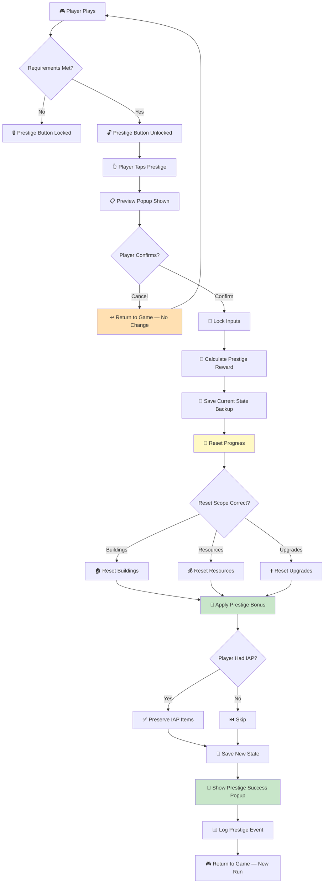

# Checklist: Prestige System

**Feature:** Prestige / Ascension / Rebirth — reset progress for permanent bonuses.  
**Type:** Functional, Regression, Economy, Data Integrity  
**Priority:** P1 (High)  
**Platform:** iOS, Android  
**Last Updated:** 2025-01-XX

---

## 📖 Overview

Prestige is a **core progression mechanic** in idle/tycoon games. Players sacrifice current progress for **permanent multipliers** that speed up future runs. A bug here can **destroy player trust, break the economy, or wipe progress irreversibly** — making this one of the highest-risk systems to test.

**Key Concepts:**
- **Prestige currency** — points/tokens earned on reset (e.g., Prestige Points, Souls)
- **Prestige bonus** — permanent multiplier applied to future runs
- **Prestige requirements** — minimum progress to unlock (e.g., reach level 50)
- **Prestige tiers** — multiple levels of prestige (P1, P2, P3…)
- **Reset scope** — what gets reset (buildings, resources) vs kept (prestige bonus, achievements)

---

## 🔄 Prestige Lifecycle Flow

---

## ✅ Core Checks — Prestige Unlock

- [ ] Prestige button is hidden before requirements are met
- [ ] Prestige button appears after requirements are met
- [ ] Requirement progress is shown in UI (e.g., "Level 45/50")
- [ ] Notification/badge appears when prestige is available
- [ ] Tutorial explains prestige mechanic (if applicable)
- [ ] Prestige is accessible from main menu and/or settings
- [ ] Prestige is not accessible during tutorial
- [ ] Prestige is not accessible during active event (if design says so)

## ✅ Core Checks — Prestige Preview

- [ ] Preview popup appears after tapping Prestige
- [ ] Preview shows **current progress** that will be lost
- [ ] Preview shows **prestige reward** to be gained
- [ ] Preview shows **new bonus multiplier** after prestige
- [ ] Preview shows **what will NOT be reset** (IAP, achievements)
- [ ] Preview has clear "Confirm" and "Cancel" buttons
- [ ] Preview cannot be dismissed by tapping outside (safety)
- [ ] Preview text is accurate and localized

## ✅ Core Checks — Prestige Execution

- [ ] Confirming prestige executes the reset
- [ ] Reset happens **atomically** (no partial state)
- [ ] Resources reset to initial values
- [ ] Buildings reset to level 0 / initial level
- [ ] Upgrades reset (unless permanent)
- [ ] Currency (soft) resets to 0
- [ ] Prestige bonus is applied permanently
- [ ] Prestige currency/tokens are added
- [ ] Player tier/level reflects new prestige state
- [ ] UI updates to reflect new state
- [ ] Prestige success popup appears
- [ ] Player returns to game in a playable state

## ✅ Core Checks — Prestige Bonus

- [ ] Bonus multiplier is applied to correct systems (resource rate, upgrade cost, etc.)
- [ ] Bonus stacks correctly across multiple prestiges
- [ ] Bonus is displayed in UI (e.g., "×2.5 Prestige Bonus")
- [ ] Bonus is preserved after app restart
- [ ] Bonus is preserved after device restart
- [ ] Bonus is preserved after reinstall (if cloud save)
- [ ] Bonus is correctly calculated (no rounding errors)
- [ ] Bonus does not exceed design cap (if any)

## ✅ Core Checks — What is Preserved

- [ ] Achievements are preserved
- [ ] IAP purchases (non-consumables) are preserved
- [ ] VIP status is preserved
- [ ] Cosmetic items are preserved
- [ ] Account level / XP is preserved (if design says so)
- [ ] Event progress is preserved (if design says so)
- [ ] Friendship / social data is preserved

---

## 🐛 Edge Cases

### Cancellation & Safety
- [ ] Cancelling preview → no state change
- [ ] Cancelling preview → resources still intact
- [ ] Cancelling preview → can prestige later
- [ ] Force close during preview → no state change
- [ ] Force close during reset → handled safely (see crash scenarios)

### Multiple Prestige
- [ ] Prestige twice in a row → bonuses stack correctly
- [ ] Prestige 10+ times → no overflow in bonus
- [ ] Prestige 100+ times → performance still OK
- [ ] Prestige at max tier → handled gracefully
- [ ] Prestige with 0 reward → blocked or warned

### Timing & Conditions
- [ ] Prestige during offline → blocked (correct)
- [ ] Prestige during ad playback → blocked
- [ ] Prestige during IAP flow → blocked
- [ ] Prestige during tutorial → blocked
- [ ] Prestige during active event → per design (blocked or warned)
- [ ] Prestige with active temporary buff → buff handled per design

### Data Integrity
- [ ] Force close during reset → no partial state
- [ ] App crash during reset → state recoverable on restart
- [ ] Network drop during reset → no double reset
- [ ] Battery dies during reset → state recoverable
- [ ] Reset is atomic — all-or-nothing

### Exploits & Anti-Abuse
- [ ] Time tamper cannot grant extra prestige reward
- [ ] Duplicate tap on "Confirm" → only one reset
- [ ] Reopening preview after confirm → shows new state
- [ ] Cannot prestige without meeting requirements (even via cheat)
- [ ] Rapid prestige in succession → rate limited (if design says so)

### Boundary Conditions
- [ ] Prestige at exactly minimum requirement → allowed
- [ ] Prestige at minimum requirement - 1 → blocked
- [ ] Prestige reward at minimum → correct value
- [ ] Prestige reward at maximum → no overflow
- [ ] Prestige bonus at 0% → handled correctly
- [ ] Prestige bonus at 1000%+ → no UI break

---

## 📱 Mobile-Specific Checks

- [ ] Prestige preview fits on small screens (portrait)
- [ ] Prestige preview fits on tablets
- [ ] Prestige works in landscape (if supported)
- [ ] Prestige popup respects device font size settings
- [ ] Prestige popup works on Android 10+
- [ ] Prestige popup works on iOS 14+
- [ ] Incoming call during prestige → handled safely
- [ ] Backgrounding app during prestige → handled safely
- [ ] Low battery during prestige → handled safely
- [ ] Prestige animation does not lag on low-end devices

---

## 🌐 Network Scenarios

- [ ] Prestige online → saved to server immediately
- [ ] Prestige offline → queued and synced when online
- [ ] Prestige with slow network → loading indicator shown
- [ ] Prestige with network drop → retry or rollback safely
- [ ] Server error during prestige → clear error message
- [ ] Prestige syncs across devices correctly
- [ ] Prestige cannot be duplicated by multi-device abuse

---

## 🎯 Regression Checks (After Update)

- [ ] Prestige requirements unchanged
- [ ] Prestige reward formula unchanged
- [ ] Prestige bonus stacking still correct
- [ ] Preview popup still shows correct data
- [ ] Reset scope unchanged
- [ ] IAP preservation still works
- [ ] No new crashes in prestige flow
- [ ] Analytics events still firing

---

## 📊 Analytics & Logging

- [ ] Prestige unlock event logged (first time available)
- [ ] Prestige preview open event logged
- [ ] Prestige confirm event logged
- [ ] Prestige cancel event logged
- [ ] Prestige reward amount logged
- [ ] Prestige tier logged
- [ ] Prestige bonus multiplier logged
- [ ] Prestige timestamp logged
- [ ] Time between prestiges logged
- [ ] Prestige with IAP event logged

---

## ⚡ Performance Checks

- [ ] Preview popup opens in < 500ms
- [ ] Reset completes in < 1 second
- [ ] No frame drops during reset animation
- [ ] No memory leak after 10+ prestiges
- [ ] Game remains playable immediately after reset

---

## 🧪 Test Scenarios (Sample)

### Scenario 1: Happy Path — First Prestige
1. Reach required level
2. Tap Prestige → confirm
3. **Expected:** Progress reset, prestige bonus applied, success popup shown

### Scenario 2: Cancel Prestige
1. Tap Prestige → preview appears
2. Tap Cancel
3. **Expected:** No reset, resources intact, can prestige later

### Scenario 3: Prestige with IAP
1. Purchase "Remove Ads" and "VIP Pack"
2. Reach prestige requirement
3. Prestige
4. **Expected:** IAP items preserved, ads still removed, VIP intact

### Scenario 4: Double Prestige
1. Prestige → claim reward
2. Reach requirement again quickly
3. Prestige again
4. **Expected:** Bonus stacks correctly, no overflow

### Scenario 5: Force Close During Prestige
1. Tap Prestige → Confirm
2. Force close app mid-reset
3. Reopen app
4. **Expected:** State is either fully reset OR fully intact (no partial)

### Scenario 6: Time Tamper
1. Change device clock forward
2. Try to prestige
3. **Expected:** Reward not inflated, handled safely

### Scenario 7: Prestige at Max Tier
1. Reach maximum prestige tier
2. Try to prestige again
3. **Expected:** Handled gracefully (blocked, or capped)

### Scenario 8: Network Drop During Prestige
1. Start prestige with WiFi
2. Turn off WiFi mid-reset
3. **Expected:** No double reset, state consistent after reconnect

### Scenario 9: Multi-Device Prestige
1. Prestige on Device A
2. Open game on Device B
3. **Expected:** Device B shows post-prestige state, no duplicate bonus

### Scenario 10: Prestige During Offline Reward
1. Trigger offline popup
2. Try to prestige without claiming
3. **Expected:** Blocked or handled per design

---

## 📋 Priority Matrix

| Check | Priority | Severity if Failed |
|---|---|---|
| Reset is atomic (no partial) | P0 | Critical |
| Prestige bonus applied correctly | P0 | Critical |
| IAP items preserved | P0 | Critical |
| Cancel does not reset | P0 | Critical |
| No double prestige | P0 | Critical |
| Preview shows correct data | P1 | Major |
| Multi-device sync | P1 | Major |
| Analytics event | P2 | Minor |
| Animation smoothness | P3 | Cosmetic |

---

## 🔗 Related Checklists

- [Resource Generation](resource-generation.md)
- [Upgrade System](upgrade-system.md)
- [Offline Progress](offline-progress.md)
- [Monetization / IAP](monetization.md)
- [Save / Load](save-load.md)
- [Network Issues](../mobile-specific/network-issues.md)
- [Testing Flow](../docs/testing-flow.md)
- [Bug Lifecycle](../docs/bug-lifecycle.md)

---

## 📝 Notes

- **Prestige requirement:** Record exact requirement (level, currency, etc.)
- **Reset scope:** Document what resets and what is preserved
- **Prestige currency:** Document currency name (e.g., Souls, Prestige Points)
- **Bonus formula:** Document how bonus is calculated
- **Cap:** Document max prestige tier and max bonus
- **Test devices:** Record device models and OS versions
- **Save backup:** Always test on a save that can be restored
- **Known issues:** Link to open bug tickets
- This checklist is a **living document** — update after each prestige rebalance

---

## ⚠️ Critical Reminders

- 🚨 **Always** test on a backup save — prestige is irreversible
- 🚨 **Always** verify atomic reset — no partial state after crash
- 🚨 **Always** verify IAP items are preserved after prestige
- 🚨 **Always** test cancel flow — losing progress is the worst UX bug
- 🚨 **Always** test multi-device to prevent double prestige
- 🚨 **Always** test time tamper — prestige is a common exploit target
