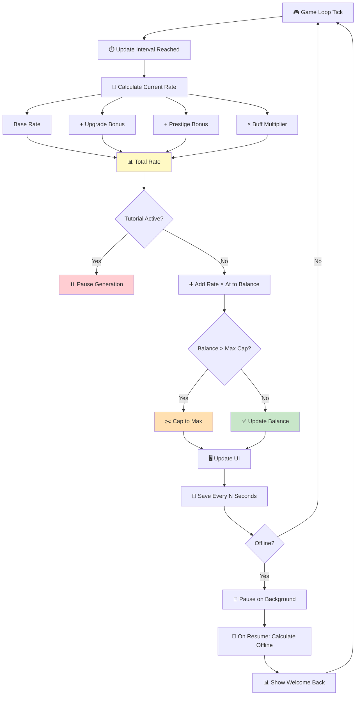

# Checklist: Resource Generation

**Feature:** Automatic resource generation (gold, gems, wood, energy) per second.  
**Type:** Functional, Regression, Economy, Performance  
**Priority:** P1 (High)  
**Platform:** iOS, Android  
**Last Updated:** 2025-01-XX

---

## 📖 Overview

Resource generation is the **heartbeat** of every idle/tycoon game. It drives progression, upgrade decisions, and player retention. A bug here can cause **economy imbalance, exploit abuse, or player churn**. This checklist covers the full generation lifecycle: rate calculation, per-tick accumulation, formatting, persistence, and interaction with other systems.

**Key Concepts:**
- **Base rate** — default resources per second
- **Upgrade bonus** — additional rate from upgrades
- **Prestige bonus** — permanent multiplier from prestige
- **Buff** — temporary multiplier (ad boost, event)
- **Tick** — internal update interval (e.g., 100ms, 1s)
- **Big number** — values beyond 2 billion (uses K/M/B/T or scientific notation)
- **Idle rate** — rate while offline (may differ from online)

---

## 🔄 Resource Generation Flow

---

## ✅ Core Checks — Basic Generation

- [ ] Resources increase automatically over time
- [ ] Increase matches the displayed rate
- [ ] Rate is displayed correctly in UI (e.g., "12.5/sec")
- [ ] Rate updates immediately after upgrade
- [ ] Counter updates smoothly (no lag or stutter)
- [ ] Counter uses correct tick interval
- [ ] Counter does not skip values (no jumps)
- [ ] Counter is monotonic (never decreases from generation)
- [ ] Counter resets correctly on prestige (if design says so)
- [ ] Counter caps correctly at max (if design says so)

## ✅ Core Checks — Rate Calculation

- [ ] Rate = base rate + upgrade bonus (correct formula)
- [ ] Rate = (base + upgrades) × prestige multiplier (correct formula)
- [ ] Rate = previous × buff multiplier (correct formula)
- [ ] Rate is calculated **once** per tick, not per frame
- [ ] Rate calculation does not drift over time
- [ ] Rate calculation is consistent across devices
- [ ] Rate calculation is deterministic (same input → same output)
- [ ] Rate includes all active bonuses correctly
- [ ] Rate excludes expired buffs correctly
- [ ] Rate is rounded consistently (per design)

## ✅ Core Checks — UI Display

- [ ] Resource counter is visible on main screen
- [ ] Resource counter updates in real time
- [ ] Resource counter does not flicker
- [ ] Resource counter uses correct abbreviation (1K, 1M, 1B, 1T)
- [ ] Number formatting is consistent (decimal places, separators)
- [ ] Number formatting respects locale (e.g., 1,000 vs 1.000)
- [ ] Negative values are never shown
- [ ] Zero displays as "0" (not empty)
- [ ] Large numbers do not overflow display area
- [ ] Icon matches resource type

## ✅ Core Checks — Persistence

- [ ] Resource balance is saved periodically
- [ ] Resource balance is saved on app close
- [ ] Resource balance is saved on background
- [ ] Resource balance is restored correctly on reopen
- [ ] Resource balance is restored correctly after crash
- [ ] Resource balance survives device restart
- [ ] Resource balance syncs across devices (if cloud save)

---

## 🧮 Calculation & Economy Checks

### Rate Formula
- [ ] Base rate matches design value
- [ ] Upgrade bonus added correctly
- [ ] Prestige multiplier applied correctly
- [ ] Buff multiplier applied correctly
- [ ] Rate = (base + upgrades) × prestige × buff (verifikasi)
- [ ] Rate displayed matches actual generation (within 1% tolerance)

### Big Numbers
- [ ] No overflow when balance > 2,147,483,647 (32-bit int)
- [ ] No overflow when balance > 9,223,372,036,854,775,807 (64-bit int)
- [ ] Uses big number library (BigNumber, decimal.js, etc.)
- [ ] Abbreviation correct: 1K, 1M, 1B, 1T, 1Qa, 1Qi, 1Sx, 1Sp, 1Oc, 1No, 1Dc
- [ ] Abbreviation does not lose precision for displayed value
- [ ] Abbreviation caps at design limit (e.g., 1aa, 1ab)
- [ ] Internal value preserves full precision

### Caps & Limits
- [ ] Max cap is respected (if design has one)
- [ ] Cap is displayed in UI
- [ ] Cap is correctly applied
- [ ] Resources do not exceed cap
- [ ] Resources at cap show full
- [ ] Cap can be upgraded (if design allows)

---

## 🐛 Edge Cases

### Zero & Negative
- [ ] When resource = 0, displays "0" (not empty)
- [ ] When rate = 0, resources do not increase
- [ ] When rate = 0, UI does not show "0/sec" awkwardly
- [ ] When rate = 0, no crash on tick
- [ ] Negative values never appear
- [ ] Balance cannot go negative from generation

### Rapid Changes
- [ ] Spam-tapping upgrade → rate updates correctly
- [ ] Rapid buff activation → multiplier applied once
- [ ] Rapid prestige → bonus stacked correctly
- [ ] Rapid close/open app → no double count

### Boundary Values
- [ ] Balance = 0 → works
- [ ] Balance = 1 → works
- [ ] Balance = max int → no overflow
- [ ] Balance = max cap → capped correctly
- [ ] Balance = max cap + 1 → capped correctly
- [ ] Rate = 0.01/sec → displayed correctly
- [ ] Rate = 999.99/sec → displayed correctly
- [ ] Rate > 1,000,000/sec → displayed in abbreviation

### Time & Tick
- [ ] Tick interval consistent (no drift)
- [ ] Tick does not skip frames on slow devices
- [ ] Tick compensates for lag (catch-up)
- [ ] Tick does not double-count after pause
- [ ] Tick does not double-count after foreground resume
- [ ] Tick paused during tutorial (per design)
- [ ] Tick paused during IAP flow (per design)
- [ ] Tick continues during popups (per design)
- [ ] Tick continues during ad playback (per design)

### Buffs & Temporary Effects
- [ ] Ad boost applies correct multiplier
- [ ] Ad boost expires correctly
- [ ] Ad boost does not stack with itself
- [ ] Event buff applies correctly
- [ ] Event buff expires correctly
- [ ] Multiple buffs stack multiplicatively (per design)
- [ ] Buff visual indicator (timer) works

---

## 📱 Mobile-Specific Checks

- [ ] Counter continues in background (per design)
- [ ] Counter catches up on foreground resume
- [ ] Counter does not drain battery excessively
- [ ] Counter works on low-end devices (no lag)
- [ ] Counter works on high-refresh displays (90Hz, 120Hz)
- [ ] Counter works on Android 10+
- [ ] Counter works on iOS 14+
- [ ] Counter works in portrait and landscape (if supported)
- [ ] Counter works on tablets
- [ ] Counter works on foldables
- [ ] Counter stops when device is locked (or continues per design)

---

## 🌐 Network Scenarios

- [ ] Generation works offline
- [ ] Generation syncs to server when online
- [ ] Generation does not double-count on reconnect
- [ ] Generation uses server time when available (anti-tamper)
- [ ] Generation works with slow network
- [ ] Generation does not spam server with requests
- [ ] Server reconciliation handles conflicts correctly

---

## 🎯 Regression Checks (After Update)

- [ ] Base rate unchanged
- [ ] Upgrade bonus formula unchanged
- [ ] Prestige bonus formula unchanged
- [ ] UI display unchanged
- [ ] Number formatting unchanged
- [ ] Save/load still works
- [ ] No new crashes in generation flow
- [ ] Analytics events still firing
- [ ] Performance unchanged
- [ ] Battery usage unchanged

---

## 📊 Analytics & Logging

- [ ] Session start event logged with balance
- [ ] Session end event logged with balance
- [ ] Rate change event logged (upgrade, buff, prestige)
- [ ] Cap hit event logged (if applicable)
- [ ] Overflow event logged (if detected)
- [ ] Buff activation event logged
- [ ] Buff expiration event logged
- [ ] Rate calculation error logged (if any)
- [ ] Time tamper detected event logged

---

## ⚡ Performance Checks

- [ ] Counter updates at target FPS (60fps or 30fps)
- [ ] No frame drops during generation
- [ ] CPU usage < 5% during idle
- [ ] Memory usage stable over 1 hour session
- [ ] No memory leak after 1 hour
- [ ] Battery drain < 2%/hour in idle
- [ ] Save operation does not block UI
- [ ] Big number operations complete in < 1ms

---

## 🧪 Test Scenarios (Sample)

### Scenario 1: Happy Path — Rate Increases with Upgrade
1. Note current rate (e.g., 10/sec)
2. Upgrade building
3. **Expected:** Rate increases by upgrade bonus, balance grows faster

### Scenario 2: Zero Rate
1. Set rate to 0 (via config or prestige)
2. Wait 10 seconds
3. **Expected:** Balance unchanged, no crash, UI shows "0/sec"

### Scenario 3: Big Number Overflow
1. Set balance to 2,147,483,647
2. Let it generate for 5 seconds
3. **Expected:** No overflow, uses big number, displays correctly

### Scenario 4: Buff Stacking
1. Activate 2x ad boost
2. Activate 2x event buff
3. **Expected:** Rate = base × 2 × 2 (per design) or stacked per design

### Scenario 5: Background / Foreground
1. Note balance
2. Background app for 5 minutes
3. Foreground app
4. **Expected:** Balance reflects 5 minutes of generation

### Scenario 6: Force Close & Reopen
1. Note balance
2. Force close app
3. Wait 1 minute
4. Reopen app
5. **Expected:** Balance reflects 1 minute (if offline generation) or unchanged (if paused)

### Scenario 7: Time Tamper — Clock Forward
1. Note balance
2. Change device clock forward 1 hour
3. **Expected:** No extra resources (or handled per anti-tamper design)

### Scenario 8: Rapid Upgrade Spam
1. Rapidly tap upgrade 10x
2. **Expected:** Rate updates 10x correctly, no double-count

### Scenario 9: Boundary — Balance at Cap
1. Set balance to cap
2. Wait for generation
3. **Expected:** Balance stays at cap, no overflow

### Scenario 10: Boundary — Rate at Max
1. Set rate to maximum (via max upgrades)
2. Wait 60 seconds
3. **Expected:** Balance increases correctly, no lag, no crash

---

## 📋 Priority Matrix

| Check | Priority | Severity if Failed |
|---|---|---|
| Resources increase correctly | P0 | Critical |
| No overflow on big numbers | P0 | Critical |
| Rate formula correct | P0 | Critical |
| Balance saved & restored | P0 | Critical |
| Cap respected | P1 | Major |
| UI display correct | P1 | Major |
| Buff stacking correct | P1 | Major |
| Analytics event | P2 | Minor |
| Battery usage | P2 | Minor |
| Animation smoothness | P3 | Cosmetic |

---

## 🔗 Related Checklists

- [Upgrade System](upgrade-system.md)
- [Prestige System](prestige-system.md)
- [Offline Progress](offline-progress.md)
- [Save / Load](save-load.md)
- [Monetization / IAP](monetization.md)
- [Ads](ads.md)
- [Network Issues](../mobile-specific/network-issues.md)
- [Background / Foreground](../mobile-specific/background-foreground.md)
- [Testing Flow](../docs/testing-flow.md)
- [Bug Lifecycle](../docs/bug-lifecycle.md)

---

## 📝 Notes

- **Base rate:** Record design value (e.g., 1 gold/sec)
- **Tick interval:** Record update interval (e.g., 100ms, 1s)
- **Max cap:** Record cap value or "no cap"
- **Number format:** Record abbreviation rules
- **Big number library:** Record which library is used (BigNumber, decimal.js, break_infinity.js)
- **Test devices:** Record device models and OS versions
- **Save interval:** Record how often balance is saved
- **Known issues:** Link to open bug tickets
- This checklist is a **living document** — update after each economy rebalance

---

## ⚠️ Critical Reminders

- 🚨 **Always** test big number overflow — idle games reach huge values fast
- 🚨 **Always** verify rate formula after any balance change
- 🚨 **Always** test time tamper — resource generation is a common exploit
- 🚨 **Always** test save/load — losing balance is the worst UX bug
- 🚨 **Always** test on low-end devices — idle games run for hours
- 🚨 **Always** verify offline vs online rate — they often differ
