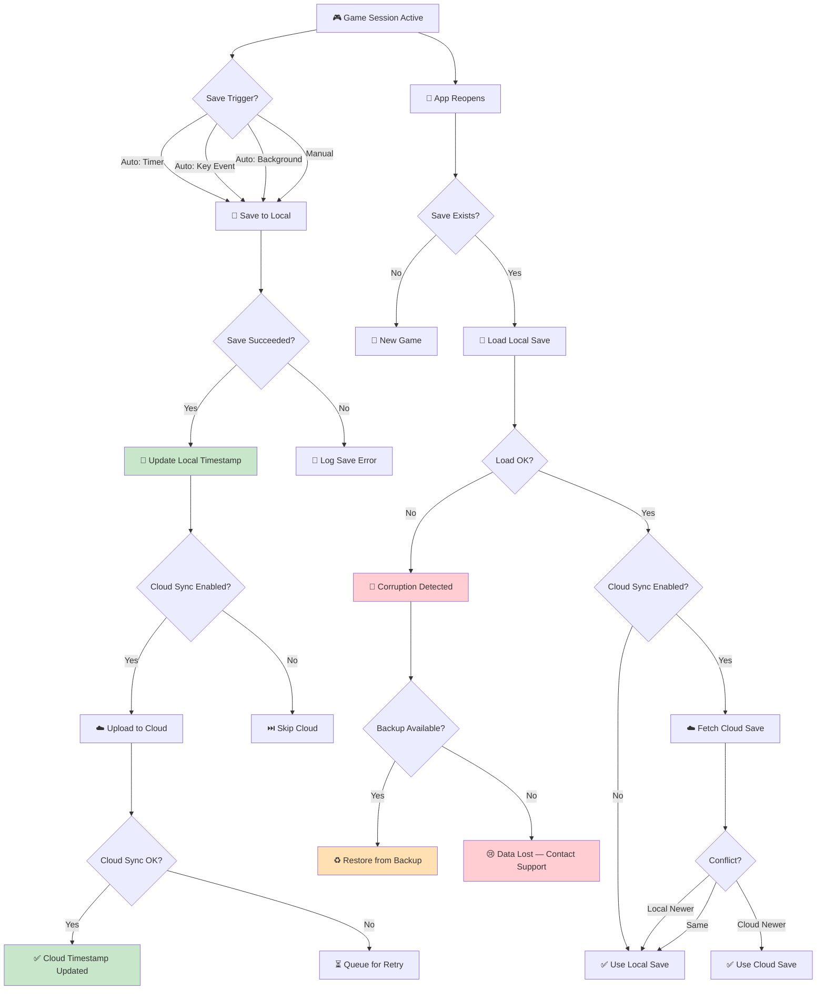

# Checklist: Save / Load

**Feature:** Progress persistence, cloud save, and data integrity across sessions.  
**Type:** Functional, Regression, Data Integrity, Security  
**Priority:** P0 (Critical)  
**Platform:** iOS, Android  
**Last Updated:** 2025-01-XX

---

## 📖 Overview

Save/Load is the **most critical system** in any game. A bug here can **wipe player progress permanently, corrupt saves, or enable exploits**. For idle/tycoon games — where players invest hours or days — losing progress is the fastest way to lose a player forever.

This checklist covers **local save**, **cloud save**, **auto-save**, **manual save**, **migration**, and **recovery**.

**Key Concepts:**
- **Local save** — stored on device (JSON, SQLite, PlayerPrefs)
- **Cloud save** — synced to server (Game Center, Play Games, custom backend)
- **Auto-save** — triggered automatically (every N seconds, on key events)
- **Manual save** — triggered by player (rare in mobile idle games)
- **Migration** — converting old save format to new
- **Corruption** — save file invalid or unreadable
- **Conflict** — two saves disagree (device vs cloud)

---

## 🔄 Save / Load Lifecycle Flow

---

## ✅ Core Checks — Auto-Save

- [ ] Progress saves automatically at defined interval (e.g., every 30s)
- [ ] Progress saves on key events (level up, prestige, purchase)
- [ ] Progress saves on app background
- [ ] Progress saves on app close
- [ ] Progress saves on device shutdown (best-effort)
- [ ] Auto-save does not block UI
- [ ] Auto-save does not cause frame drops
- [ ] Auto-save failure is logged
- [ ] Auto-save retry mechanism works
- [ ] Auto-save interval is configurable (per design)

## ✅ Core Checks — Local Save

- [ ] Save file is created on first play
- [ ] Save file is written atomically (no partial write)
- [ ] Save file is stored in correct location (app sandbox)
- [ ] Save file is encrypted or obfuscated (anti-cheat)
- [ ] Save file size is reasonable (< 1MB typical)
- [ ] Save file contains all critical data (balance, upgrades, prestige, IAP)
- [ ] Save file does not contain sensitive data (passwords, tokens)
- [ ] Save file is not writable by other apps

## ✅ Core Checks — Load

- [ ] Save loads correctly on app start
- [ ] Save loads correctly after force close
- [ ] Save loads correctly after device restart
- [ ] Save loads correctly after app update
- [ ] Save loads correctly after reinstall (if cloud save)
- [ ] Save loads in < 2 seconds
- [ ] Save loads without crash
- [ ] Save loads all data correctly (no missing fields)
- [ ] Missing fields use defaults (no crash)
- [ ] Corrupted save triggers recovery (see below)

## ✅ Core Checks — Cloud Save

- [ ] Cloud save is enabled by default or opt-in (per design)
- [ ] Cloud save syncs after each local save
- [ ] Cloud save syncs on app open
- [ ] Cloud save syncs on app close
- [ ] Cloud save syncs on network reconnect
- [ ] Cloud save conflict resolution works (see below)
- [ ] Cloud save works across iOS and Android (if cross-platform)
- [ ] Cloud save works with Game Center / Play Games
- [ ] Cloud save works with custom backend
- [ ] Cloud save respects user privacy settings

## ✅ Core Checks — Account & Multi-Device

- [ ] Logging in → progress syncs from cloud
- [ ] Logging out → progress stays local (or cleared per design)
- [ ] Switching devices → progress follows account
- [ ] Playing offline → progress saved locally, syncs when online
- [ ] Playing on two devices → conflict resolved correctly
- [ ] Playing on two devices offline → no data loss on sync
- [ ] Guest account → link account → progress preserved
- [ ] Guest account → uninstall → progress lost (expected)

---

## 🐛 Edge Cases

### Force Close & Crash
- [ ] Force close during save → no partial write
- [ ] Force close during load → no corruption
- [ ] Crash during save → save file intact (atomic write)
- [ ] Crash during load → next launch recovers
- [ ] Battery dies during save → save file intact
- [ ] OS kills app during save → save file intact

### Corruption & Recovery
- [ ] Corrupted save → detected on load
- [ ] Corrupted save → backup restored (if available)
- [ ] Corrupted save → clear error message
- [ ] Corrupted save → user can start fresh (with warning)
- [ ] Corrupted save → logged for support
- [ ] Partial save (missing fields) → defaults applied
- [ ] Invalid JSON → handled gracefully
- [ ] Checksum mismatch → detected and handled

### Version Migration
- [ ] Old save (v1) → load in new version (v2) → works
- [ ] Old save → migration applied automatically
- [ ] Old save → missing new fields → defaults applied
- [ ] Old save → deprecated fields removed
- [ ] Very old save (v0.1) → migration chain works
- [ ] Migration failure → clear error, no crash
- [ ] Migration is one-way (no downgrade)

### Conflict Resolution
- [ ] Local newer than cloud → local wins
- [ ] Cloud newer than local → cloud wins
- [ ] Same timestamp → tie-breaker rule applied
- [ ] Different progress values → per design (highest wins, latest wins, etc.)
- [ ] Conflict during offline → resolved on reconnect
- [ ] Conflict notification shown to user (if design says so)

### Storage Issues
- [ ] Storage full → clear error message
- [ ] Storage full → save retried when space available
- [ ] Storage permission revoked → handled gracefully
- [ ] SD card removed (if used) → handled
- [ ] Low storage warning shown to user

### Time & Tamper
- [ ] Device clock changed → save timestamp validated
- [ ] Device clock changed backward → no save corruption
- [ ] Device clock changed forward → no exploit
- [ ] Server time used for conflict resolution (when available)
- [ ] Time tamper detected → logged and handled

### Account & Auth
- [ ] Login token expired → re-auth prompt
- [ ] Login on new device → cloud save fetched
- [ ] Account deleted → local save cleared
- [ ] Account banned → handled per policy
- [ ] Multiple accounts on same device → saves separated

---

## 📱 Mobile-Specific Checks

- [ ] Save works on Android 10+
- [ ] Save works on iOS 14+
- [ ] Save works on low-end devices
- [ ] Save works on tablets
- [ ] Save works on foldables
- [ ] Save works with app in split-screen
- [ ] Save works with incoming call interruption
- [ ] Save works with alarm interruption
- [ ] Save works with low battery mode
- [ ] Save works with battery saver on
- [ ] Save does not drain battery excessively

---

## 🌐 Network Scenarios

- [ ] Save works offline (local only)
- [ ] Save queues cloud sync when offline
- [ ] Cloud sync retries on reconnect
- [ ] Cloud sync does not spam server
- [ ] Cloud sync handles slow network
- [ ] Cloud sync handles network drop mid-upload
- [ ] Cloud sync handles server error (5xx)
- [ ] Cloud sync handles rate limiting (429)
- [ ] Cloud sync respects user data usage settings

---

## 🔐 Security & Anti-Cheat Checks

- [ ] Save file is encrypted or obfuscated
- [ ] Save file cannot be edited easily (checksum, signature)
- [ ] Edited save file → rejected or flagged
- [ ] Server-side validation on critical values (currency, prestige)
- [ ] Replay attack → detected
- [ ] Save file does not store plaintext sensitive data
- [ ] Cloud save uses HTTPS
- [ ] Cloud save uses auth token
- [ ] Cloud save respects user privacy (GDPR, CCPA)

---

## 🎯 Regression Checks (After Update)

- [ ] Auto-save still works
- [ ] Local save still loads
- [ ] Cloud save still syncs
- [ ] Migration still works
- [ ] Conflict resolution still correct
- [ ] No new crashes in save/load flow
- [ ] Analytics events still firing
- [ ] Save file format unchanged (or migration applied)
- [ ] Save size unchanged (or acceptable)
- [ ] Save/load performance unchanged

---

## 📊 Analytics & Logging

- [ ] Save started event logged
- [ ] Save succeeded event logged
- [ ] Save failed event logged (with reason)
- [ ] Load started event logged
- [ ] Load succeeded event logged
- [ ] Load failed event logged
- [ ] Corruption detected event logged
- [ ] Migration applied event logged
- [ ] Conflict detected event logged
- [ ] Cloud sync event logged
- [ ] Save file size logged

---

## ⚡ Performance Checks

- [ ] Save completes in < 500ms
- [ ] Load completes in < 2 seconds
- [ ] Save does not block UI thread
- [ ] Load does not block UI thread
- [ ] No frame drops during save
- [ ] No frame drops during load
- [ ] Memory usage stable after 100 saves
- [ ] No memory leak in save/load flow
- [ ] Battery impact < 1% per hour from auto-save

---

## 🧪 Test Scenarios (Sample)

### Scenario 1: Happy Path — Save & Load
1. Play game, note progress
2. Wait for auto-save
3. Force close app
4. Reopen app
5. **Expected:** Progress matches pre-close state

### Scenario 2: Force Close During Save
1. Trigger save
2. Force close app immediately
3. Reopen app
4. **Expected:** Save file intact (either old or new, not partial)

### Scenario 3: Corrupted Save Recovery
1. Manually corrupt save file
2. Reopen app
3. **Expected:** Backup restored OR clear error message

### Scenario 4: Cloud Save Conflict
1. Play on Device A offline → progress +100
2. Play on Device B online → progress +50
3. Device A comes online
4. **Expected:** Conflict resolved per design (highest / latest wins)

### Scenario 5: Version Migration
1. Install app v1.0, play, save
2. Update to v1.1
3. Open app
4. **Expected:** Save migrated, no data lost

### Scenario 6: Reinstall with Cloud Save
1. Play with cloud save enabled
2. Uninstall app
3. Reinstall, log in
4. **Expected:** Progress restored from cloud

### Scenario 7: Storage Full
1. Fill device storage to 100%
2. Trigger save
3. **Expected:** Clear error message, no crash

### Scenario 8: Time Tamper
1. Play, save
2. Change device clock forward 1 day
3. Reopen app
4. **Expected:** Save loads, no exploit, tamper logged

### Scenario 9: Multi-Device Same Time
1. Play on Device A and Device B offline simultaneously
2. Both come online
3. **Expected:** Conflict resolved without data loss

### Scenario 10: Save File Size Growth
1. Play for many hours
2. Check save file size
3. **Expected:** Size stays reasonable (< 1MB or per design)

---

## 📋 Priority Matrix

| Check | Priority | Severity if Failed |
|---|---|---|
| Save loads correctly | P0 | Critical |
| No corruption on crash | P0 | Critical |
| Atomic save write | P0 | Critical |
| Cloud sync works | P0 | Critical |
| Conflict resolution correct | P0 | Critical |
| Migration works | P1 | Major |
| Save file encrypted | P1 | Major |
| Save performance | P2 | Minor |
| Analytics event | P2 | Minor |
| Save file size | P3 | Cosmetic |

---

## 🔗 Related Checklists

- [Resource Generation](resource-generation.md)
- [Upgrade System](upgrade-system.md)
- [Prestige System](prestige-system.md)
- [Offline Progress](offline-progress.md)
- [Monetization / IAP](monetization.md)
- [Network Issues](../mobile-specific/network-issues.md)
- [Background / Foreground](../mobile-specific/background-foreground.md)
- [Interruptions](../mobile-specific/interruptions.md)
- [Testing Flow](../docs/testing-flow.md)
- [Bug Lifecycle](../docs/bug-lifecycle.md)

---

## 📝 Notes

- **Save format:** Record format (JSON, SQLite, PlayerPrefs, custom binary)
- **Save location:** Record path (sandbox, Application Support, etc.)
- **Save interval:** Record auto-save interval (e.g., 30s)
- **Cloud provider:** Record provider (Game Center, Play Games, custom)
- **Encryption:** Record encryption method (AES, obfuscation)
- **Backup strategy:** Record number of backups kept (e.g., 2)
- **Migration chain:** Document all migration versions (v1→v2→v3)
- **Test devices:** Record device models and OS versions
- **Known issues:** Link to open bug tickets
- This checklist is a **living document** — update after each save format change

---

## ⚠️ Critical Reminders

- 🚨 **Always** use atomic write — never partially write save file
- 🚨 **Always** keep a backup — the previous save must be recoverable
- 🚨 **Always** test force-close during save — this is the #1 corruption cause
- 🚨 **Always** test version migration — players update apps constantly
- 🚨 **Always** test conflict resolution — multi-device is common
- 🚨 **Always** encrypt save file — edited saves enable cheating
- 🚨 **Never** lose player progress — this is unforgivable UX
