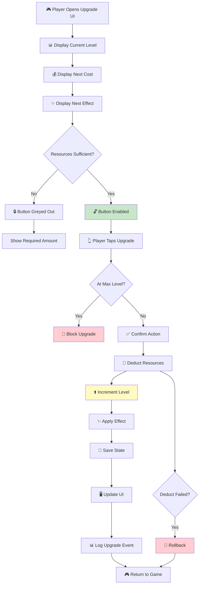

# Checklist: Upgrade System

**Feature:** Level up buildings / heroes / skills by spending resources.  
**Type:** Functional, Regression, Economy, Integration  
**Priority:** P1 (High)  
**Platform:** iOS, Android  
**Last Updated:** 2025-01-XX

---

## 📖 Overview

The upgrade system is the **primary progression driver** in idle/tycoon games. Players spend resources to increase levels, unlock new content, and boost generation rates. A bug here can cause **economy imbalance, exploit abuse, or player frustration**.

This checklist covers the full upgrade lifecycle: display, validation, execution, effect application, and interaction with other systems.

**Key Concepts:**
- **Upgrade cost** — resource required for next level
- **Cost formula** — often exponential (e.g., base × 1.15^level)
- **Upgrade effect** — stat boost (rate, capacity, speed)
- **Max level** — hard cap per upgrade (if any)
- **Bulk upgrade** — upgrade multiple levels at once (if supported)
- **Auto-upgrade** — automatic upgrade feature (if supported)

---

## 🔄 Upgrade Lifecycle Flow

---

## ✅ Core Checks — UI Display

- [ ] Upgrade button is visible on the correct screen
- [ ] Current level is displayed correctly (e.g., "Lv. 5")
- [ ] Next level is displayed correctly (e.g., "Lv. 6")
- [ ] Upgrade cost is displayed correctly
- [ ] Upgrade cost uses correct abbreviation (1K, 1M, 1B)
- [ ] Next effect preview is displayed correctly
- [ ] Effect delta is shown (e.g., "+5 → +8")
- [ ] Progress bar (if any) updates correctly
- [ ] Max level indicator appears when at cap
- [ ] UI is responsive (no lag when scrolling)
- [ ] Icons match the upgrade type
- [ ] Tooltip/description is accurate

## ✅ Core Checks — Button State

- [ ] Button is greyed out when resources insufficient
- [ ] Button is enabled when resources sufficient
- [ ] Button is disabled at max level
- [ ] Button shows loading state during upgrade
- [ ] Button cannot be spammed (debounced)
- [ ] Button state updates immediately after resource change
- [ ] Button state updates immediately after upgrade
- [ ] Button haptic feedback works (if supported)
- [ ] Button sound effect plays (if supported)

## ✅ Core Checks — Upgrade Execution

- [ ] Tapping Upgrade deducts correct resources
- [ ] Tapping Upgrade increments level by exactly 1
- [ ] Tapping Upgrade applies the correct effect
- [ ] Tapping Upgrade saves state
- [ ] Tapping Upgrade updates UI
- [ ] Tapping Upgrade plays animation/sound
- [ ] Tapping Upgrade logs analytics event
- [ ] Upgrade completes in < 500ms
- [ ] Upgrade does not block UI thread

## ✅ Core Checks — Cost Calculation

- [ ] Cost matches formula (e.g., base × 1.15^level)
- [ ] Cost increases correctly for first 5 levels
- [ ] Cost increases correctly for levels 10, 50, 100
- [ ] Cost does not overflow at high levels (uses big number)
- [ ] Cost is displayed with correct rounding
- [ ] Cost differs per upgrade type (correct design)
- [ ] Cost resets correctly on prestige (if design says so)
- [ ] Cost is reduced by discounts correctly (if any)
- [ ] Cost is not affected by time or device

## ✅ Core Checks — Effect Application

- [ ] Effect is applied immediately after upgrade
- [ ] Effect formula matches design
- [ ] Effect stacks correctly across multiple upgrades
- [ ] Effect is reflected in resource generation rate
- [ ] Effect is reflected in UI
- [ ] Effect is reflected in calculations
- [ ] Effect persists after app restart
- [ ] Effect persists after prestige (if permanent)
- [ ] Effect is removed on prestige (if not permanent)

---

## 💰 Cost & Economy Checks

### Formula Verification
- [ ] Base cost matches design
- [ ] Cost multiplier matches design
- [ ] Cost formula is consistent across levels
- [ ] Cost is not affected by buffs/debuffs (unless design says so)
- [ ] Cost is calculated client-side OR server-side (per design)
- [ ] Cost displayed matches cost deducted

### Bulk Upgrade (if supported)
- [ ] Bulk upgrade calculates total cost correctly
- [ ] Bulk upgrade deducts total cost correctly
- [ ] Bulk upgrade increments level correctly
- [ ] Bulk upgrade respects max level
- [ ] Bulk upgrade applies effect correctly
- [ ] Bulk upgrade does not partially complete
- [ ] Bulk upgrade handles insufficient resources

### Auto-Upgrade (if supported)
- [ ] Auto-upgrade triggers at correct interval
- [ ] Auto-upgrade respects priority order
- [ ] Auto-upgrade stops when resources insufficient
- [ ] Auto-upgrade can be toggled on/off
- [ ] Auto-upgrade does not spam server
- [ ] Auto-upgrade logs events correctly

---

## 🐛 Edge Cases

### Rapid Tapping
- [ ] Rapidly tapping Upgrade → only one upgrade per tap
- [ ] Rapidly tapping Upgrade → no negative resources
- [ ] Rapidly tapping Upgrade → no double-upgrade
- [ ] Rapidly tapping Upgrade → UI updates correctly
- [ ] Rapidly tapping Upgrade → no crash

### Boundary Values
- [ ] Upgrading with exactly enough resources → succeeds
- [ ] Upgrading with 1 less than required → blocked
- [ ] Upgrading with 0 resources → blocked
- [ ] Upgrading at max level → blocked
- [ ] Upgrading at max level - 1 → succeeds
- [ ] Upgrading with cost = max int → no overflow
- [ ] Upgrading with effect = max int → no overflow

### Interaction with Other Systems
- [ ] Upgrading while event popup is open → handled
- [ ] Upgrading while ad is playing → blocked (per design)
- [ ] Upgrading while IAP is processing → blocked
- [ ] Upgrading during offline → blocked (correct)
- [ ] Upgrading during tutorial → restricted per design
- [ ] Upgrading during prestige → blocked
- [ ] Upgrading while in background → blocked

### Failure & Recovery
- [ ] Network drop during upgrade → rollback or retry
- [ ] Server error during upgrade → clear message
- [ ] Force close during upgrade → no partial state
- [ ] Crash during upgrade → state consistent on restart
- [ ] Insufficient resources detected server-side → rejected

### Exploits & Anti-Abuse
- [ ] Time tamper does not affect cost
- [ ] Save file edit → cost manipulation detected
- [ ] Duplicate tap → only one upgrade
- [ ] Race condition → no double upgrade
- [ ] Client-server mismatch → server wins

---

## 📱 Mobile-Specific Checks

- [ ] Upgrade UI fits on small screens (portrait)
- [ ] Upgrade UI fits on tablets
- [ ] Upgrade UI works in landscape (if supported)
- [ ] Upgrade works on Android 10+
- [ ] Upgrade works on iOS 14+
- [ ] Upgrade works on low-end devices
- [ ] Upgrade does not cause frame drops
- [ ] Upgrade animation is smooth
- [ ] Upgrade works with incoming call interruption
- [ ] Upgrade works with low battery mode

---

## 🌐 Network Scenarios

- [ ] Upgrade works offline (if design allows)
- [ ] Upgrade online → synced to server
- [ ] Upgrade with slow network → loading indicator
- [ ] Upgrade with network drop → rollback or queue
- [ ] Upgrade with server error → clear message
- [ ] Upgrade syncs across devices
- [ ] Upgrade does not duplicate on reconnect

---

## 🎯 Regression Checks (After Update)

- [ ] Cost formula unchanged
- [ ] Effect formula unchanged
- [ ] Max level unchanged
- [ ] UI display unchanged
- [ ] Upgrade execution unchanged
- [ ] Save/load still works
- [ ] No new crashes in upgrade flow
- [ ] Analytics events still firing
- [ ] Performance unchanged
- [ ] Prestige interaction unchanged

---

## 📊 Analytics & Logging

- [ ] Upgrade UI open event logged
- [ ] Upgrade button tap event logged
- [ ] Upgrade success event logged
- [ ] Upgrade fail event logged (with reason)
- [ ] Upgrade level logged
- [ ] Upgrade cost logged
- [ ] Upgrade effect logged
- [ ] Bulk upgrade event logged (if applicable)
- [ ] Auto-upgrade event logged (if applicable)
- [ ] Upgrade time between events logged

---

## ⚡ Performance Checks

- [ ] Upgrade completes in < 500ms
- [ ] UI updates in < 100ms after upgrade
- [ ] No frame drops during upgrade animation
- [ ] No memory leak after 100+ upgrades
- [ ] Cost calculation completes in < 10ms
- [ ] Bulk upgrade of 100 levels completes in < 2s

---

## 🧪 Test Scenarios (Sample)

### Scenario 1: Happy Path — Single Upgrade
1. Note current level and resources
2. Tap Upgrade
3. **Expected:** Level +1, resources -cost, effect applied

### Scenario 2: Insufficient Resources
1. Reduce resources below cost
2. Try to upgrade
3. **Expected:** Button greyed out, no action on tap

### Scenario 3: Max Level
1. Reach max level
2. Try to upgrade
3. **Expected:** Button disabled, "MAX" indicator shown

### Scenario 4: Rapid Tap Spam
1. Rapidly tap Upgrade 10 times
2. **Expected:** Only valid upgrades execute, no negative resources

### Scenario 5: Exact Resources
1. Set resources exactly equal to cost
2. Upgrade
3. **Expected:** Upgrade succeeds, resources = 0

### Scenario 6: Cost Overflow
1. Reach level 1000
2. Check cost
3. **Expected:** Cost displayed in big number format, no overflow

### Scenario 7: Bulk Upgrade
1. Have resources for 10 levels
2. Use bulk upgrade x10
3. **Expected:** Level +10, correct total cost deducted

### Scenario 8: Force Close Mid-Upgrade
1. Tap Upgrade
2. Force close immediately
3. Reopen app
4. **Expected:** State consistent (either upgraded or not, not partial)

### Scenario 9: Network Drop
1. Start upgrade online
2. Turn off WiFi mid-upgrade
3. **Expected:** Upgrade completes locally or rolls back safely

### Scenario 10: Prestige Interaction
1. Upgrade a building
2. Prestige
3. **Expected:** Upgrade reset per design, prestige bonus applied

### Scenario 11: Effect Stacking
1. Upgrade building A to level 5
2. Upgrade building B to level 5
3. **Expected:** Effects stack correctly

### Scenario 12: Discount Applied
1. Activate discount buff
2. Check upgrade cost
3. **Expected:** Cost reduced by correct percentage

---

## 📋 Priority Matrix

| Check | Priority | Severity if Failed |
|---|---|---|
| Upgrade executes correctly | P0 | Critical |
| No negative resources | P0 | Critical |
| No double upgrade | P0 | Critical |
| Cost formula correct | P0 | Critical |
| Effect applied correctly | P0 | Critical |
| Max level respected | P1 | Major |
| UI display correct | P1 | Major |
| Bulk upgrade correct | P1 | Major |
| Analytics event | P2 | Minor |
| Animation smoothness | P3 | Cosmetic |

---

## 🔗 Related Checklists

- [Resource Generation](resource-generation.md)
- [Prestige System](prestige-system.md)
- [Offline Progress](offline-progress.md)
- [Monetization / IAP](monetization.md)
- [Save / Load](save-load.md)
- [Network Issues](../mobile-specific/network-issues.md)
- [Background / Foreground](../mobile-specific/background-foreground.md)
- [Testing Flow](../docs/testing-flow.md)
- [Bug Lifecycle](../docs/bug-lifecycle.md)

---

## 📝 Notes

- **Cost formula:** Record formula (e.g., base × 1.15^level)
- **Effect formula:** Record formula (e.g., +10% per level)
- **Max level:** Record max level per upgrade (or "no cap")
- **Bulk upgrade:** Confirm if supported and step size
- **Auto-upgrade:** Confirm if supported and behavior
- **Discount rules:** Document discount sources and stacking
- **Test devices:** Record device models and OS versions
- **Known issues:** Link to open bug tickets
- This checklist is a **living document** — update after each economy rebalance

---

## ⚠️ Critical Reminders

- 🚨 **Always** test exact-resource boundary — off-by-one bugs are common
- 🚨 **Always** test rapid tapping — race conditions cause double upgrades
- 🚨 **Always** verify cost formula matches design after any balance change
- 🚨 **Always** test big number overflow — idle games reach huge costs
- 🚨 **Always** test save/load after upgrade — losing upgrade is bad UX
- 🚨 **Always** test prestige interaction — some upgrades reset, some don't
- 🚨 **Always** verify server-side validation — client-side cost can be edited
