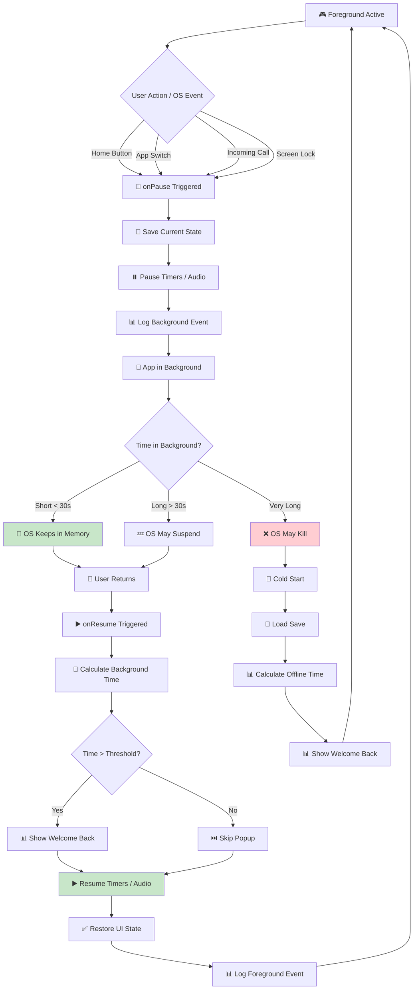

# Checklist: Background / Foreground

**Feature:** App lifecycle handling — background, foreground, suspend, and resume.  
**Type:** Functional, Regression, Lifecycle, Integration  
**Priority:** P1 (High)  
**Platform:** iOS, Android  
**Last Updated:** 2025-01-XX

---

## 📖 Overview

Mobile games must handle the app lifecycle gracefully. Players constantly switch between apps — reading messages, taking calls, checking notifications. A bug here can cause **progress loss, frozen timers, duplicate rewards, or crashes** — all highly visible to the player.

This checklist covers the full lifecycle: background, foreground, suspend, resume, and OS-initiated termination.

**Key Concepts:**
- **Background** — app not visible but still in memory
- **Foreground** — app visible and active
- **Suspend** — OS pauses app to save battery
- **Resume** — app returns to foreground
- **Termination** — OS kills app to free memory
- **Lifecycle events** — onPause, onResume (Android), applicationDidEnterBackground, applicationWillEnterForeground (iOS)
- **Idle timer** — in-game timer that counts real time
- **Session** — a continuous period of active play

---

## 🔄 Background / Foreground Lifecycle Flow

---

## ✅ Core Checks — Background Transition

- [ ] Pressing Home → app goes to background
- [ ] App switches to another app → goes to background
- [ ] Screen lock → app goes to background
- [ ] Incoming call → app goes to background
- [ ] Incoming alarm → app goes to background
- [ ] Background transition is instant (no freeze)
- [ ] Game state is saved before backgrounding
- [ ] Audio pauses on background (per design)
- [ ] Timers pause on background (per design)
- [ ] Push notifications still received

## ✅ Core Checks — Foreground Transition

- [ ] Reopening app → game continues from last state
- [ ] UI is exactly as left (per design)
- [ ] Timers resume correctly
- [ ] Audio resumes correctly (or stays muted per design)
- [ ] Idle timer accounts for background time
- [ ] Welcome back popup appears (if threshold met)
- [ ] No visible glitch during transition
- [ ] Transition completes in < 1 second
- [ ] No crash on resume
- [ ] Analytics event logged

## ✅ Core Checks — State Preservation

- [ ] Current screen is preserved (main, shop, upgrade)
- [ ] Scroll position is preserved (in lists)
- [ ] Open popups are preserved
- [ ] Open dialogs are preserved
- [ ] Tutorial progress is preserved
- [ ] Active buffs continue correctly
- [ ] Active ad is resumed or refreshed
- [ ] Active IAP flow is handled safely
- [ ] Input field content is preserved
- [ ] Camera position (if applicable) is preserved

## ✅ Core Checks — Timers & Counters

- [ ] Idle timer continues during background
- [ ] Idle timer accounts for background time on resume
- [ ] Session timer pauses during background (if design says so)
- [ ] Buff timers continue during background
- [ ] Cooldown timers continue during background
- [ ] Event timers continue during background
- [ ] Timer precision is accurate (±1 second)
- [ ] Timers do not double-count
- [ ] Timers do not lose time
- [ ] Timers sync with server time when available

## ✅ Core Checks — Notifications

- [ ] Push notifications received in background
- [ ] Local notifications trigger in background
- [ ] Notification tap opens correct screen
- [ ] Notification does not duplicate
- [ ] Notification respects user settings
- [ ] Notification respects "Do Not Disturb"
- [ ] Notification does not spam user
- [ ] Notification content is accurate
- [ ] Deep link from notification works
- [ ] Notification permission handled correctly

---

## 🐛 Edge Cases

### Short Background (< 30 seconds)
- [ ] Background < 5s → resume without popup
- [ ] Background < 30s → resume without popup
- [ ] Background < threshold → no offline reward
- [ ] Background < threshold → no analytics spam
- [ ] State fully preserved

### Long Background (> 30 minutes)
- [ ] Background 30 min → no crash on resume
- [ ] Background 1 hour → offline reward calculated
- [ ] Background 8 hours → offline reward capped
- [ ] Background 24 hours → app may be killed by OS
- [ ] Background > 24h → cold start handled correctly

### OS-Initiated Termination
- [ ] App killed by OS in background → cold start on reopen
- [ ] Save file intact after OS kill
- [ ] No data loss after OS kill
- [ ] Cold start uses offline reward calculation
- [ ] Cold start analytics event logged
- [ ] Cold start does not show double welcome popup

### Background During Activity
- [ ] Background during ad → ad resumes or refreshes
- [ ] Background during ad → reward still granted correctly
- [ ] Background during IAP → IAP flow handled safely
- [ ] Background during save → save completes or rolls back
- [ ] Background during load → load completes or restarts
- [ ] Background during prestige → prestige completes or rolls back
- [ ] Background during tutorial → tutorial step preserved

### Background During Popup
- [ ] Background with popup open → popup remains
- [ ] Background with confirmation dialog → dialog remains
- [ ] Background with keyboard open → keyboard dismissed
- [ ] Background with input focus → focus preserved
- [ ] Background with animation playing → animation paused/resumed

### Rapid Background / Foreground
- [ ] Rapid toggling 10x → no crash
- [ ] Rapid toggling 10x → no duplicate rewards
- [ ] Rapid toggling 10x → no data corruption
- [ ] Rapid toggling 10x → analytics events correct
- [ ] Rapid toggling 10x → performance stable

### Multi-Window & Split-Screen
- [ ] Split-screen (Android) → handles correctly
- [ ] Picture-in-picture → handles correctly
- [ ] Floating window → handles correctly
- [ ] iPad Slide Over → handles correctly
- [ ] iPad Split View → handles correctly

---

## 📱 Mobile-Specific Checks

### iOS
- [ ] Works on iOS 14+
- [ ] Works on iOS 15, 16, 17
- [ ] Works on iPhone SE (small screen)
- [ ] Works on iPad (large screen)
- [ ] Works with Face ID unlock
- [ ] Works with "Background App Refresh" off
- [ ] Works with "Low Power Mode" on
- [ ] Works with "Low Data Mode" on
- [ ] Respects "Screen Time" limits

### Android
- [ ] Works on Android 10+
- [ ] Works on Android 11, 12, 13, 14
- [ ] Works with "Battery Saver" on
- [ ] Works with "Data Saver" on
- [ ] Works with "Adaptive Battery" on
- [ ] Works with "Do Not Disturb" on
- [ ] Works with different OEM skins (Samsung, Xiaomi, Oppo)
- [ ] Works with Android Go (low-end)

### Cross-Platform
- [ ] Background behavior consistent across iOS/Android
- [ ] Foreground behavior consistent across iOS/Android
- [ ] Offline reward consistent across platforms
- [ ] Save/load consistent across platforms
- [ ] Analytics events consistent

---

## 🌐 Network Scenarios

- [ ] Background while online → reconnect on resume
- [ ] Background while offline → no error on resume
- [ ] Background during cloud sync → sync completes or retries
- [ ] Background during download → download pauses/resumes
- [ ] Background with slow network → handled gracefully
- [ ] Background with airplane mode → handled gracefully
- [ ] Resume with network restored → sync kicks in
- [ ] Resume with network lost → offline mode active

---

## 🎯 Regression Checks (After Update)

- [ ] Background transition unchanged
- [ ] Foreground transition unchanged
- [ ] State preservation unchanged
- [ ] Timer accuracy unchanged
- [ ] Offline reward unchanged
- [ ] No new crashes in lifecycle
- [ ] Analytics events still firing
- [ ] Performance unchanged
- [ ] Battery usage unchanged

---

## 📊 Analytics & Logging

- [ ] App background event logged
- [ ] App foreground event logged
- [ ] Background duration logged
- [ ] Cold start event logged
- [ ] Warm start event logged
- [ ] Session duration logged
- [ ] OS kill detected (if possible)
- [ ] Background threshold hit event logged
- [ ] Notification received event logged
- [ ] Notification tap event logged

---

## ⚡ Performance Checks

- [ ] Background transition completes in < 500ms
- [ ] Foreground transition completes in < 1s
- [ ] No frame drops during transition
- [ ] No memory leak after 50 background/foreground cycles
- [ ] Background state uses < 50MB memory
- [ ] Battery drain in background < 1%/hour
- [ ] Resume does not spike CPU
- [ ] UI renders instantly on resume

---

## 🧪 Test Scenarios (Sample)

### Scenario 1: Short Background — Home Button
1. Play game
2. Press Home for 5 seconds
3. Return to game
4. **Expected:** State preserved, no popup, no timer lost

### Scenario 2: Long Background — 1 Hour
1. Play game, note balance
2. Background for 1 hour
3. Return
4. **Expected:** Offline reward popup, balance updated correctly

### Scenario 3: OS Kill — Force Close
1. Play game
2. Force close app (swipe up on iOS, swipe away on Android)
3. Wait 10 minutes
4. Reopen app
5. **Expected:** Cold start, offline reward calculated correctly

### Scenario 4: Background During Ad
1. Start reward ad
2. Background app mid-ad
3. Return to app
4. **Expected:** Ad resumes, reward still granted on completion

### Scenario 5: Background During IAP
1. Start IAP flow
2. Background app
3. Return
4. **Expected:** IAP flow handled safely (either resumed or cancelled cleanly)

### Scenario 6: Rapid Toggle
1. Press Home → return → Home → return (10x fast)
2. **Expected:** No crash, no duplicate rewards, state consistent

### Scenario 7: Incoming Call
1. Start playing
2. Receive call
3. Answer, talk 30s, hang up
4. Return to game
5. **Expected:** Game paused during call, resumed correctly after

### Scenario 8: Low Battery Mode
1. Enable Low Power / Battery Saver
2. Background and return
3. **Expected:** Works correctly, respects system behavior

### Scenario 9: Split Screen (Android)
1. Open game in split screen with another app
2. Interact with other app
3. Return to game
4. **Expected:** Game handles split-screen lifecycle correctly

### Scenario 10: iPad Slide Over
1. Open game full screen
2. Slide another app over
3. Dismiss slide over
4. **Expected:** Game state preserved, no glitch

### Scenario 11: Notification Tap
1. Background game
2. Receive notification
3. Tap notification
4. **Expected:** Game opens to correct screen via deep link

### Scenario 12: Screen Lock
1. Play game
2. Lock screen for 5 minutes
3. Unlock
4. **Expected:** Game paused during lock, offline reward on resume (if applicable)

---

## 📋 Priority Matrix

| Check | Priority | Severity if Failed |
|---|---|---|
| State preserved on resume | P0 | Critical |
| No data loss on background | P0 | Critical |
| No crash on resume | P0 | Critical |
| Timer accuracy | P0 | Critical |
| No duplicate rewards | P0 | Critical |
| Offline reward correct | P1 | Major |
| Notification works | P1 | Major |
| OS kill handled | P1 | Major |
| Analytics event | P2 | Minor |
| Transition speed | P2 | Minor |

---

## 🔗 Related Checklists

- [Offline Progress](../checklists/offline-progress.md)
- [Save / Load](../checklists/save-load.md)
- [Ads](../checklists/ads.md)
- [Monetization / IAP](../checklists/monetization.md)
- [Interruptions](interruptions.md)
- [Network Issues](network-issues.md)
- [Testing Flow](../docs/testing-flow.md)
- [Bug Lifecycle](../docs/bug-lifecycle.md)

---

## 📝 Notes

- **Background threshold:** Record minimum time for offline popup (e.g., 60s)
- **Save on background:** Confirm if save happens on background
- **Timer behavior:** Confirm if timers pause or continue
- **Audio behavior:** Confirm if audio pauses on background
- **Push notifications:** Confirm if enabled and provider
- **Deep links:** Document supported deep links
- **Test devices:** Record device models and OS versions
- **OEM behavior:** Test on Samsung, Xiaomi, Oppo (custom Android skins)
- **Known issues:** Link to open bug tickets
- This checklist is a **living document** — update after each lifecycle change

---

## ⚠️ Critical Reminders

- 🚨 **Always** test on real devices — emulators behave differently for lifecycle
- 🚨 **Always** test OS kill scenario — this is how most players "close" apps
- 🚨 **Always** test rapid toggle — race conditions cause double rewards
- 🚨 **Always** test timer accuracy — off-by-one causes player frustration
- 🚨 **Always** test on multiple OEMs — Android lifecycle differs by manufacturer
- 🚨 **Always** test split-screen and PiP — modern multitasking is common
- 🚨 **Never** lose player state on background — it's the most visible bug
