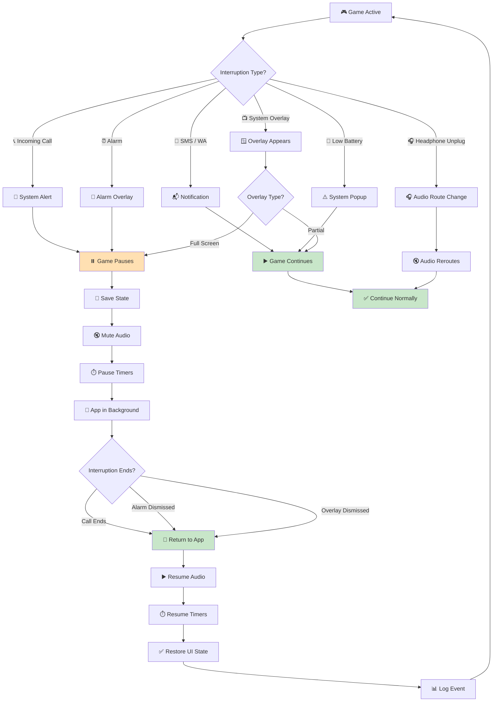

# Checklist: Mobile Interruptions

**Feature:** Handling of system-level interruptions — calls, SMS, alarms, notifications, and overlays.  
**Type:** Functional, Regression, Lifecycle, Integration  
**Priority:** P1 (High)  
**Platform:** iOS, Android  
**Last Updated:** 2025-01-XX

---

## 📖 Overview

Mobile devices constantly interrupt the player — calls, messages, alarms, low battery warnings, system popups. A game that handles these poorly feels **broken, unprofessional, and frustrating**. In idle/tycoon games, interruptions can also cause **timer drift, lost progress, or duplicate rewards**.

This checklist covers every common interruption type on mobile: telephony, messaging, alarms, system overlays, and third-party app overlays.

**Key Concepts:**
- **Interruption** — any external event that takes focus from the game
- **Pause** — game stops all activity (timers, audio, animations)
- **Suspend** — OS sends app to background (see background/foreground checklist)
- **Overlay** — UI element drawn on top of the game
- **Audio focus** — Android concept for audio priority
- **AVAudioSession** — iOS audio session management
- **Focus loss** — when game loses audio/interaction focus

---

## 🔄 Interruption Lifecycle Flow

---

## ✅ Core Checks — Incoming Call

### Voice Call (Cellular)
- [ ] Incoming call → game pauses automatically
- [ ] Incoming call → audio mutes
- [ ] Incoming call → timers pause (or continue per design)
- [ ] Incoming call → game state is saved
- [ ] Answering call → game stays paused
- [ ] Rejecting call → game resumes normally
- [ ] Call ends → game resumes automatically
- [ ] Call ends → audio resumes
- [ ] Call ends → no duplicate reward
- [ ] Call ends → no crash
- [ ] Call during tutorial → state preserved
- [ ] Call during ad → ad handling (see edge cases)

### VoIP Call (WhatsApp, Telegram, Zoom)
- [ ] WhatsApp call → game pauses
- [ ] Telegram call → game pauses
- [ ] Zoom/Meet call → game pauses
- [ ] VoIP call ends → game resumes
- [ ] VoIP call → audio focus handled
- [ ] VoIP call → no crash
- [ ] VoIP call → state preserved

### Call Waiting
- [ ] Call waiting → current call + game handled
- [ ] Switching between calls → game stays paused
- [ ] Ending all calls → game resumes

---

## ✅ Core Checks — SMS / Messaging

- [ ] SMS notification → game does NOT pause (correct)
- [ ] SMS notification → game continues normally
- [ ] WhatsApp notification → game does NOT pause
- [ ] Telegram notification → game does NOT pause
- [ ] Notification banner overlay → game visible behind
- [ ] Notification sound → game audio unaffected
- [ ] Tapping notification → game pauses (user leaves)
- [ ] Dismissing notification → game continues
- [ ] Multiple notifications → no lag
- [ ] Full-screen notification (head-up) → does not steal input

---

## ✅ Core Checks — Alarms

- [ ] Alarm fires → game pauses
- [ ] Alarm fires → game audio mutes
- [ ] Alarm fires → alarm sound plays (system priority)
- [ ] Alarm dismissed → game resumes
- [ ] Alarm snoozed → game stays paused
- [ ] Alarm during ad → handled gracefully
- [ ] Alarm during IAP → handled safely
- [ ] Alarm during tutorial → state preserved
- [ ] Multiple alarms → handled correctly
- [ ] Alarm while phone on silent → game unaffected

---

## ✅ Core Checks — System Popups

- [ ] Low battery popup → game continues
- [ ] Low battery popup → game not paused
- [ ] Low battery popup → audio not affected
- [ ] Low storage warning → game continues
- [ ] Storage full → game handles gracefully
- [ ] System update prompt → game continues
- [ ] Airplane mode toggle → game handles correctly
- [ ] Wi-Fi/Bluetooth prompt → game continues
- [ ] Permission request → game pauses input until dismissed
- [ ] Screen recording prompt → game continues

---

## ✅ Core Checks — Notifications (Push & Local)

- [ ] Push notification received → banner shown
- [ ] Push notification → game does NOT pause
- [ ] Push notification → no audio glitch
- [ ] Push notification tap → deep link opens correct screen
- [ ] Push notification dismiss → game continues
- [ ] Local notification → same behavior
- [ ] Notification permission denied → game still works
- [ ] Notification during ad → handled gracefully
- [ ] Notification during IAP → handled safely
- [ ] Multiple push notifications → no spam

---

## ✅ Core Checks — Audio Interruptions

- [ ] Headphone unplug → audio pauses (iOS) or reroutes
- [ ] Headphone plug → audio reroutes correctly
- [ ] Bluetooth disconnect → audio pauses or reroutes
- [ ] Bluetooth connect → audio reroutes correctly
- [ ] Silent mode switch → game respects it
- [ ] Volume change → game respects it
- [ ] Audio focus loss (Android) → game pauses audio
- [ ] Audio focus regained → game resumes audio
- [ ] Background music app → game handles correctly
- [ ] Voice assistant (Siri/Google) → game pauses

---

## ✅ Core Checks — Screen & Lock

- [ ] Screen lock → game pauses
- [ ] Screen unlock → game resumes
- [ ] Screen off (timeout) → game pauses
- [ ] Screen rotation → game handles (portrait/landscape)
- [ ] Split screen (Android) → game handles
- [ ] Picture-in-picture → game handles
- [ ] Screen recording → game continues
- [ ] Screenshot → game continues
- [ ] Casting to TV → game handles

---

## 🐛 Edge Cases

### Incoming Call During Critical Actions
- [ ] Call during ad → ad pauses, resumes after call
- [ ] Call during ad → reward still granted correctly
- [ ] Call during IAP → IAP flow handled safely
- [ ] Call during save → save completes or rolls back
- [ ] Call during load → load completes or restarts
- [ ] Call during prestige → prestige completes or rolls back
- [ ] Call during upgrade → upgrade completes or rolls back
- [ ] Call during tutorial → tutorial step preserved
- [ ] Call during offline reward popup → popup preserved
- [ ] Call during welcome back popup → popup preserved

### Incoming Call During Loading
- [ ] Call during splash screen → no crash
- [ ] Call during asset loading → handled gracefully
- [ ] Call during level loading → handled gracefully
- [ ] Call during server connect → handled gracefully
- [ ] Call during login → handled gracefully

### Rapid Interruptions
- [ ] Call → dismiss → call again rapidly → no crash
- [ ] Notification spam → no lag
- [ ] Multiple system popups → no queue overflow
- [ ] Alarm + call same time → handled correctly
- [ ] Notification + call same time → no crash

### Audio Interruptions During Critical Audio
- [ ] Headphone unplug during ad → handled
- [ ] Headphone unplug during IAP jingle → handled
- [ ] Bluetooth disconnect during cutscene → handled
- [ ] Volume change during ad → handled

### Timer Integrity
- [ ] Timers pause during call → correct
- [ ] Timers resume after call → no drift
- [ ] Timers do not double-count during interruption
- [ ] Timers do not lose time
- [ ] Timer precision is accurate (±1 second)

### Rewards & Progress
- [ ] No duplicate rewards after interruption
- [ ] No lost rewards after interruption
- [ ] Progress saved correctly
- [ ] State consistent on resume
- [ ] Analytics events correct

---

## 📱 Mobile-Specific Checks

### iOS Specific
- [ ] Works on iOS 14+
- [ ] Works on iOS 15, 16, 17
- [ ] CallKit integration works
- [ ] AVAudioSession handled correctly
- [ ] "Do Not Disturb" respected
- [ ] Focus mode respected
- [ ] Screen Time limits respected
- [ ] Emergency call (SOS) handled
- [ ] FaceTime call handled
- [ ] AirDrop notification handled

### Android Specific
- [ ] Works on Android 10+
- [ ] Works on Android 11, 12, 13, 14
- [ ] Audio focus handled correctly
- [ ] Do Not Disturb mode respected
- [ ] Battery Saver respected
- [ ] Adaptive Battery respected
- [ ] Multiple SIM handling
- [ ] Emergency call handled
- [ ] Google Duo / Meet handled
- [ ] OEM skins (Samsung, Xiaomi, Oppo) tested

### Cross-Platform
- [ ] Behavior consistent across iOS/Android
- [ ] Timer behavior consistent
- [ ] Audio behavior consistent
- [ ] Save behavior consistent
- [ ] Analytics events consistent

---

## 🌐 Network Scenarios

- [ ] Call during online play → reconnect on resume
- [ ] Call during offline play → no error on resume
- [ ] Call during cloud sync → sync completes or retries
- [ ] Call during download → download pauses/resumes
- [ ] Call with slow network → handled gracefully
- [ ] Call with airplane mode → handled gracefully
- [ ] Notification while offline → handled correctly
- [ ] Notification tap while offline → handled correctly

---

## 🎯 Regression Checks (After Update)

- [ ] Call handling unchanged
- [ ] SMS handling unchanged
- [ ] Alarm handling unchanged
- [ ] System popup handling unchanged
- [ ] Audio interruption handling unchanged
- [ ] Timer behavior unchanged
- [ ] No new crashes in interruption flow
- [ ] Analytics events still firing
- [ ] Performance unchanged

---

## 📊 Analytics & Logging

- [ ] Interruption type logged
- [ ] Interruption start time logged
- [ ] Interruption end time logged
- [ ] Interruption duration logged
- [ ] Resume event logged
- [ ] Pause event logged
- [ ] Audio focus loss logged
- [ ] Audio focus regain logged
- [ ] Timer pause logged
- [ ] Timer resume logged
- [ ] Duplicate reward detected logged

---

## ⚡ Performance Checks

- [ ] Pause on interruption < 500ms
- [ ] Resume after interruption < 1s
- [ ] No frame drops during interruption
- [ ] No memory leak after 50 interruptions
- [ ] Battery impact minimal
- [ ] Audio resume latency < 300ms
- [ ] UI renders instantly on resume

---

## 🧪 Test Scenarios (Sample)

### Scenario 1: Incoming Call During Gameplay
1. Play game normally
2. Receive call, answer
3. Talk 30s, hang up
4. **Expected:** Game paused during call, resumed correctly, no lost progress

### Scenario 2: Reject Call
1. Play game
2. Receive call
3. Reject
4. **Expected:** Game resumes immediately, no pause visible

### Scenario 3: SMS Notification
1. Play game
2. Receive SMS
3. **Expected:** Game continues, banner appears, no pause

### Scenario 4: Alarm Fires
1. Play game
2. Alarm fires
3. Dismiss alarm
4. **Expected:** Game paused during alarm, resumed after

### Scenario 5: Call During Ad
1. Start reward ad
2. Receive call, answer
3. End call, return to game
4. **Expected:** Ad resumes or restarts, reward granted correctly

### Scenario 6: Call During IAP
1. Start IAP flow
2. Receive call
3. End call
4. **Expected:** IAP flow handled safely (either resumed or cancelled cleanly)

### Scenario 7: Headphone Unplug
1. Play with headphone
2. Unplug headphone
3. **Expected:** Audio pauses or reroutes to speaker

### Scenario 8: Bluetooth Disconnect
1. Play with Bluetooth speaker
2. Disconnect Bluetooth
3. **Expected:** Audio pauses or reroutes to phone speaker

### Scenario 9: Low Battery Popup
1. Drain battery to 15%
2. Low battery popup appears
3. **Expected:** Game continues, no pause, no audio glitch

### Scenario 10: Notification Tap
1. Play game
2. Receive push notification
3. Tap notification
4. **Expected:** Game opens to correct screen via deep link

### Scenario 11: Multiple Interruptions
1. Play game
2. Receive call + SMS simultaneously
3. Handle both
4. **Expected:** No crash, state consistent

### Scenario 12: Rapid Call Cycle
1. Receive call → reject → receive → reject (5x)
2. **Expected:** No crash, no state loss, no duplicate rewards

### Scenario 13: Screen Lock During Play
1. Play game
2. Lock screen
3. Wait 5 min
4. Unlock
5. **Expected:** Game paused during lock, offline reward on resume

### Scenario 14: Emergency Call
1. Play game
2. Trigger emergency SOS
3. **Expected:** Game pauses, emergency handled

### Scenario 15: Voice Assistant
1. Play game
2. Activate Siri/Google Assistant
3. Dismiss assistant
4. **Expected:** Game paused, resumed correctly

---

## 📋 Priority Matrix

| Check | Priority | Severity if Failed |
|---|---|---|
| Call pauses game | P0 | Critical |
| Resume after call works | P0 | Critical |
| No crash on interruption | P0 | Critical |
| No data loss | P0 | Critical |
| No duplicate rewards | P0 | Critical |
| SMS does not pause | P1 | Major |
| Timer accuracy | P1 | Major |
| Audio handling | P1 | Major |
| Notification works | P1 | Major |
| Analytics event | P2 | Minor |
| Resume speed | P2 | Minor |

---

## 🔗 Related Checklists

- [Offline Progress](../checklists/offline-progress.md)
- [Save / Load](../checklists/save-load.md)
- [Ads](../checklists/ads.md)
- [Monetization / IAP](../checklists/monetization.md)
- [Background / Foreground](background-foreground.md)
- [Network Issues](network-issues.md)
- [Testing Flow](../docs/testing-flow.md)
- [Bug Lifecycle](../docs/bug-lifecycle.md)

---

## 📝 Notes

- **Interruption types:** Document all supported interruption types
- **Pause behavior:** Confirm which interruptions pause vs continue
- **Timer behavior:** Confirm if timers pause during interruption
- **Save on interruption:** Confirm if save happens on interruption
- **Audio behavior:** Confirm audio pause/resume rules
- **Test devices:** Record device models and OS versions
- **OEM behavior:** Test on Samsung, Xiaomi, Oppo (custom Android skins)
- **Carrier behavior:** Test on different carriers (VoLTE, VoWiFi)
- **Known issues:** Link to open bug tickets
- This checklist is a **living document** — update after each lifecycle change

---

## ⚠️ Critical Reminders

- 🚨 **Always** test on real devices with real SIM cards — emulators fake calls
- 🚨 **Always** test VoIP calls (WhatsApp, Telegram) — separate from cellular
- 🚨 **Always** test rapid interruptions — race conditions cause crashes
- 🚨 **Always** test audio route changes — headphone unplug is a common bug
- 🚨 **Always** test interruption during critical flows (ad, IAP, save)
- 🚨 **Always** test on multiple OEMs — Android call handling varies widely
- 🚨 **Never** lose player progress on interruption — it's the most visible bug
