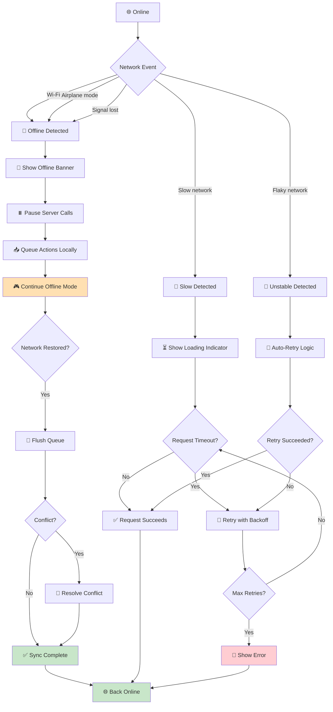

# Checklist: Network Issues

**Feature:** Handling of network state changes — offline, slow, unstable, and reconnect.  
**Type:** Functional, Regression, Integration, Resilience  
**Priority:** P1 (High)  
**Platform:** iOS, Android  
**Last Updated:** 2025-01-XX

---

## 📖 Overview

Mobile networks are **unreliable by nature** — Wi-Fi drops, cellular switches, elevators, tunnels, airplane mode. A game that handles network issues poorly feels **broken, loses progress, or charges players twice**. For idle/tycoon games with IAP and cloud save, network resilience is **critical**.

This checklist covers the full network lifecycle: online → offline → unstable → reconnect, and how each system (save, IAP, ads, analytics) behaves.

**Key Concepts:**
- **Online** — stable connection available
- **Offline** — no connection available
- **Unstable** — connection present but intermittent
- **Slow** — high latency or low bandwidth
- **Reconnect** — connection restored after loss
- **Queue** — actions stored locally until online
- **Retry** — automatic re-attempt after failure
- **Backoff** — increasing delay between retries
- **Idempotency** — same request can be safely repeated

---

## 🔄 Network Lifecycle Flow

---

## ✅ Core Checks — Network Detection

- [ ] Game detects Wi-Fi off → shows offline state
- [ ] Game detects Wi-Fi on → shows online state
- [ ] Game detects airplane mode → shows offline state
- [ ] Game detects cellular → shows online state
- [ ] Game detects cellular → Wi-Fi switch → no glitch
- [ ] Game detects Wi-Fi → cellular switch → no glitch
- [ ] Game detects network lost mid-session → banner appears
- [ ] Game detects network restored → banner disappears
- [ ] Detection is fast (< 2 seconds)
- [ ] Detection is accurate (no false positives)
- [ ] Detection does not drain battery
- [ ] Detection works on Android 10+
- [ ] Detection works on iOS 14+

## ✅ Core Checks — Offline Mode

- [ ] Offline → game does not crash
- [ ] Offline → game can still be played (per design)
- [ ] Offline → idle generation continues
- [ ] Offline → timers continue correctly
- [ ] Offline → offline reward calculated on reconnect
- [ ] Offline → IAP is blocked with clear message
- [ ] Offline → ads are skipped or fallback shown
- [ ] Offline → cloud save queued for later
- [ ] Offline → analytics events queued
- [ ] Offline → user sees clear offline indicator

## ✅ Core Checks — Reconnect

- [ ] Reconnect → banner disappears automatically
- [ ] Reconnect → queued actions flush
- [ ] Reconnect → server sync completes
- [ ] Reconnect → state is consistent
- [ ] Reconnect → no duplicate actions
- [ ] Reconnect → no lost actions
- [ ] Reconnect → analytics events sent
- [ ] Reconnect → cloud save syncs
- [ ] Reconnect → offline reward calculated
- [ ] Reconnect does not crash

## ✅ Core Checks — Error Handling

- [ ] Server unreachable → clear error message
- [ ] Server timeout → retry with backoff
- [ ] Server 500 → retry with backoff
- [ ] Server 429 (rate limit) → respects Retry-After
- [ ] Server 401 (unauthorized) → re-auth prompt
- [ ] Server 403 (forbidden) → clear message
- [ ] Server 404 (not found) → handled gracefully
- [ ] DNS failure → clear message
- [ ] SSL error → clear message
- [ ] No infinite retry loop

---

## 🐛 Edge Cases

### Sudden Disconnect
- [ ] Disconnect during save → no corruption
- [ ] Disconnect during load → recovers or retries
- [ ] Disconnect during IAP → transaction safe (see IAP checklist)
- [ ] Disconnect during ad → ad fails gracefully
- [ ] Disconnect during cloud sync → queue for retry
- [ ] Disconnect during analytics send → queue event
- [ ] Disconnect during login → clear message
- [ ] Disconnect during tutorial → tutorial state preserved
- [ ] Disconnect during prestige → rollback or queue
- [ ] Disconnect during upgrade → rollback or queue

### Slow Network
- [ ] Slow network → loading indicator shown
- [ ] Slow network → user cannot spam actions
- [ ] Slow network → requests eventually timeout
- [ ] Slow network → timeout triggers retry
- [ ] Slow network → UI remains responsive
- [ ] Slow network → no ANR (Android)
- [ ] Slow network → no watchdog kill (iOS)

### Unstable Network
- [ ] Flaky network → auto-retry works
- [ ] Flaky network → no duplicate requests
- [ ] Flaky network → no data corruption
- [ ] Flaky network → exponential backoff applied
- [ ] Flaky network → user informed of retry

### Wi-Fi / Cellular Switching
- [ ] Wi-Fi → cellular switch → no glitch
- [ ] Cellular → Wi-Fi switch → no glitch
- [ ] Switch during IAP → transaction safe
- [ ] Switch during save → safe
- [ ] Switch during cloud sync → retry
- [ ] Switch mid-request → request restarts

### Airplane Mode
- [ ] Airplane mode on → offline mode active
- [ ] Airplane mode off → reconnect automatically
- [ ] Airplane mode on → game playable
- [ ] Airplane mode on → no crash
- [ ] Airplane mode with Wi-Fi on → Wi-Fi works
- [ ] Airplane mode toggled rapidly → no crash

### Captive Portal
- [ ] Hotel Wi-Fi with captive portal → handled
- [ ] Airport Wi-Fi with login page → handled
- [ ] Captive portal → user informed
- [ ] Captive portal → game does not hang

### VPN & Proxy
- [ ] VPN on → game works
- [ ] VPN on → game does not crash
- [ ] VPN off → reconnect works
- [ ] Proxy → game works
- [ ] DNS over HTTPS → works

### Server-Side Issues
- [ ] Server maintenance → clear message
- [ ] Server down → retry with backoff
- [ ] Server migration → reconnect works
- [ ] CDN outage → fallback asset loading
- [ ] Third-party API down (ads, analytics) → game continues

### Time & Clock
- [ ] Network time sync → uses server time
- [ ] Device clock wrong → server time wins
- [ ] Timezone change → handled
- [ ] DST change → handled
- [ ] Time tamper → logged

---

## 📱 Mobile-Specific Checks

### iOS Specific
- [ ] Works on iOS 14+
- [ ] Works on iOS 15, 16, 17
- [ ] Works with "Low Data Mode"
- [ ] Works with "Wi-Fi Assist" on
- [ ] Works with VPN on
- [ ] Works with Personal Hotspot
- [ ] Works with 5G
- [ ] Works with LTE
- [ ] Handles iOS network extension

### Android Specific
- [ ] Works on Android 10+
- [ ] Works on Android 11, 12, 13, 14
- [ ] Works with "Data Saver"
- [ ] Works with "Adaptive Connectivity"
- [ ] Works with VPN on
- [ ] Works with tethering
- [ ] Works with 5G
- [ ] Works with LTE
- [ ] Handles OEM network stacks (Samsung, Xiaomi, Oppo)

### Cross-Platform
- [ ] Behavior consistent across iOS/Android
- [ ] Retry logic consistent
- [ ] Timeout values consistent
- [ ] Offline mode consistent
- [ ] Analytics events consistent

---

## 🌐 Network Scenarios

### Connection Types
- [ ] 5G → works
- [ ] 4G/LTE → works
- [ ] 3G → works
- [ ] 2G/EDGE → works (slow but functional)
- [ ] Wi-Fi 2.4GHz → works
- [ ] Wi-Fi 5GHz → works
- [ ] Wi-Fi 6 → works
- [ ] Ethernet (via adapter) → works

### Connection Quality
- [ ] High latency (500ms+) → handled
- [ ] Low bandwidth (< 100kbps) → handled
- [ ] Packet loss 10% → handled
- [ ] Packet loss 50% → handled or fails gracefully
- [ ] Jitter → handled

### Offline Duration
- [ ] Offline < 1 minute → no issues
- [ ] Offline 1 hour → queue flushed on reconnect
- [ ] Offline 24 hours → queue flushed, no overflow
- [ ] Offline 7 days → queue handled gracefully
- [ ] Offline with many queued actions → handled

### Concurrent Requests
- [ ] Multiple requests in flight → no crash
- [ ] Multiple requests → correct ordering
- [ ] Multiple requests → no deadlock
- [ ] Requests cancelled on background → handled
- [ ] Requests cancelled on app kill → handled

---

## 🔐 Security & Anti-Fraud Checks

- [ ] HTTPS used for all requests
- [ ] Certificate pinning (if applicable)
- [ ] Token refresh handled correctly
- [ ] Token expired → re-auth
- [ ] Replay attack → detected
- [ ] MITM attempt → detected
- [ ] Fake server → rejected
- [ ] Modified client → rejected
- [ ] Rate limiting respected
- [ ] Sensitive data not logged

---

## 🎯 Regression Checks (After Update)

- [ ] Network detection unchanged
- [ ] Offline mode unchanged
- [ ] Reconnect flow unchanged
- [ ] Retry logic unchanged
- [ ] Timeout values unchanged
- [ ] Error handling unchanged
- [ ] No new crashes in network flow
- [ ] Analytics events still firing
- [ ] Performance unchanged
- [ ] Battery usage unchanged

---

## 📊 Analytics & Logging

- [ ] Network state change logged
- [ ] Offline event logged
- [ ] Online event logged
- [ ] Reconnect event logged
- [ ] Request failure logged (with reason)
- [ ] Retry attempt logged
- [ ] Timeout event logged
- [ ] Queue flush event logged
- [ ] Conflict detected event logged
- [ ] Network type logged (Wi-Fi, cellular, etc.)
- [ ] Network latency logged

---

## ⚡ Performance Checks

- [ ] Network detection < 2 seconds
- [ ] Reconnect < 5 seconds
- [ ] No frame drops during network event
- [ ] No memory leak after 100+ network changes
- [ ] Battery impact < 1%/hour
- [ ] Request timeout reasonable (e.g., 30s)
- [ ] Retry backoff reasonable (e.g., 1s, 2s, 4s, 8s)
- [ ] Queue does not grow unbounded
- [ ] UI remains responsive during retry

---

## 🧪 Test Scenarios (Sample)

### Scenario 1: Wi-Fi Off → Offline Banner
1. Play game online
2. Turn off Wi-Fi
3. **Expected:** Offline banner appears, game continues, offline mode active

### Scenario 2: Wi-Fi On → Reconnect
1. Play offline
2. Turn on Wi-Fi
3. **Expected:** Banner disappears, sync happens, no crash

### Scenario 3: Airplane Mode
1. Enable airplane mode
2. Play game
3. Disable airplane mode
4. **Expected:** Game playable offline, reconnects when online

### Scenario 4: Disconnect During Save
1. Start a save operation
2. Turn off Wi-Fi mid-save
3. **Expected:** Save either completes or rolls back, no corruption

### Scenario 5: Disconnect During IAP
1. Start IAP flow
2. Turn off Wi-Fi mid-purchase
3. **Expected:** IAP handled safely, no double charge

### Scenario 6: Slow Network
1. Throttle network to 2G speeds
2. Play game
3. **Expected:** Loading indicators shown, no crash, no ANR

### Scenario 7: Flaky Network
1. Simulate 50% packet loss
2. Play game
3. **Expected:** Auto-retry works, no duplicate actions

### Scenario 8: Wi-Fi → Cellular Switch
1. Play on Wi-Fi
2. Switch to cellular mid-action
3. **Expected:** No glitch, action completes or retries

### Scenario 9: Server Down
1. Simulate server 500 error
2. Play game
3. **Expected:** Clear error message, retry with backoff

### Scenario 10: Rate Limited
1. Simulate server 429 response
2. Play game
3. **Expected:** Respects Retry-After header, no spam

### Scenario 11: Offline Queue Overflow
1. Play offline for 7 days with many actions
2. Reconnect
3. **Expected:** Queue flushed correctly, no overflow, no crash

### Scenario 12: Time Tamper
1. Change device clock forward
2. Play game
3. **Expected:** Server time used, tamper logged

### Scenario 13: Captive Portal
1. Connect to hotel Wi-Fi with captive portal
2. Play game
3. **Expected:** User informed, game does not hang

### Scenario 14: VPN On
1. Enable VPN
2. Play game
3. **Expected:** Game works, no crash

### Scenario 15: Rapid Network Toggle
1. Toggle Wi-Fi on/off rapidly 10x
2. **Expected:** No crash, state consistent, queue handled

### Scenario 16: Multiple Concurrent Requests
1. Trigger 10 requests simultaneously
2. **Expected:** All complete correctly, no deadlock

### Scenario 17: Offline Analytics
1. Play offline for 30 min
2. Reconnect
3. **Expected:** All analytics events sent, correct order

### Scenario 18: Cloud Save Conflict
1. Play offline on Device A (progress +100)
2. Play online on Device B (progress +50)
3. Reconnect Device A
4. **Expected:** Conflict resolved, no data loss

---

## 📋 Priority Matrix

| Check | Priority | Severity if Failed |
|---|---|---|
| Offline mode works | P0 | Critical |
| Reconnect works | P0 | Critical |
| No data corruption on disconnect | P0 | Critical |
| IAP safe on disconnect | P0 | Critical |
| No duplicate actions | P0 | Critical |
| Timeout + retry logic | P1 | Major |
| Error messages clear | P1 | Major |
| Queue flush correct | P1 | Major |
| Analytics event | P2 | Minor |
| Battery usage | P2 | Minor |

---

## 🔗 Related Checklists

- [Offline Progress](../checklists/offline-progress.md)
- [Save / Load](../checklists/save-load.md)
- [Monetization / IAP](../checklists/monetization.md)
- [Ads](../checklists/ads.md)
- [Resource Generation](../checklists/resource-generation.md)
- [Background / Foreground](background-foreground.md)
- [Interruptions](interruptions.md)
- [Testing Flow](../docs/testing-flow.md)
- [Bug Lifecycle](../docs/bug-lifecycle.md)

---

## 📝 Notes

- **Detection library:** Record which network library is used (Reachability, ConnectivityManager)
- **Timeout values:** Document timeouts per request type
- **Retry strategy:** Document retry count and backoff
- **Offline queue:** Document queue size limit and flush policy
- **Conflict resolution:** Document conflict resolution rules
- **Server time:** Confirm if server time is authoritative
- **Test tools:** Use Network Link Conditioner (iOS), Charles Proxy, mitmproxy
- **Test devices:** Record device models and OS versions
- **Known issues:** Link to open bug tickets
- This checklist is a **living document** — update after each network change

---

## ⚠️ Critical Reminders

- 🚨 **Always** test on real networks — emulators lie about connectivity
- 🚨 **Always** test captive portals — hotel/airport Wi-Fi is common
- 🚨 **Always** test Wi-Fi ↔ cellular switch — this is the #1 network bug
- 🚨 **Always** verify idempotency — retries must not duplicate actions
- 🚨 **Always** test slow networks — 2G/3G users still exist
- 🚨 **Always** test offline for extended periods — queue overflow is real
- 🚨 **Never** trust client-side time — always cross-check with server
- 🚨 **Never** retry infinitely — use exponential backoff with max retries
